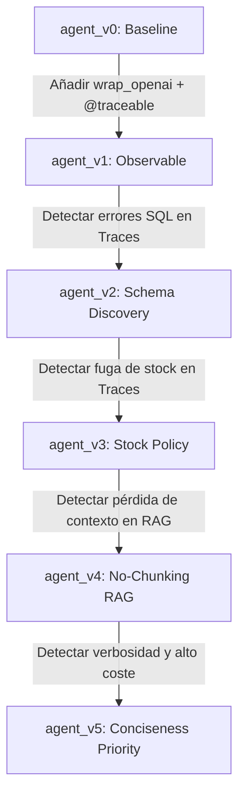

# Módulo 1 - Lección 3: Analyzing your Agent

> **URL del Curso**: [https://academy.langchain.com/courses/take/building-reliable-agents/multimedia/72643953-lesson-3-analyzing-your-agent](https://academy.langchain.com/courses/take/building-reliable-agents/multimedia/72643953-lesson-3-analyzing-your-agent)

---

## 🎯 Objetivo de la Lección
En esta lección fundamental del curso **Building Reliable Agents**, aprenderás a utilizar **LangSmith Tracing** como herramienta de diagnóstico activa para auditar las ejecuciones de un agente real (**Emma**, de OfficeFlow Supply Co.), descubrir fallos frente a las especificaciones del producto (**PRD**) y aplicar un ciclo de mejora continua a través de 6 versiones iterativas (`agent_v0.py` hasta `agent_v5.py`).

---

## 🔍 ¿Por Qué Falla el Debugging Tradicional en Agentes?

En el software determinista convencional:
- Un bug arroja un `Traceback` o una excepción clara en consola.
- Los tests unitarios comparan valores esperados exactos (`assert a == b`).

En sistemas con Agentes de Inteligencia Artificial:
- El agente puede completar su ejecución con código de salida `0` (sin errores aparentes), pero:
  1. **Alucinar datos de stock**.
  2. **Inventar columnas de SQL** que no existen en la base de datos.
  3. **Divulgar información confidencial** de la empresa (cantidades de inventario).
  4. **Recuperar fragmentos irrelevantes** de políticas internas y responder erróneamente.
  5. **Gastar miles de tokens** en respuestas excesivamente prolijas y lentas.

👉 **La Observabilidad en LangSmith es la única forma de inspeccionar qué pensó el modelo, qué herramientas llamó y con qué argumentos, y qué contexto RAG recibió exactamente.**

---

## 🧪 Escenarios del PRD y Diagnóstico Paso a Paso

Durante esta lección, se ejecutan las siguientes pruebas contra el agente en la carpeta [`officeflow-agent/`](file:///f:/Cursos_code/LANGCHAIN/Building_Releable_Agents/officeflow-agent):

### 1. Escenario de Consulta de Base de Datos SQL
- **Pregunta de prueba**: *"¿Cuántos bolígrafos azules tienen y cuál es el precio?"*
- **Diagnóstico en LangSmith (`agent_v1.py`)**:
  - Al abrir el Trace en LangSmith, se observa el span `query_database`.
  - El modelo ejecutó: `SELECT stock_quantity FROM products WHERE name LIKE '%blue pen%'`.
  - La base de datos devolvió error: `no such column: stock_quantity`.
  - El modelo intentó adivinar otra columna, consumiendo más tokens y tiempo.
- **Solución implementada en [`agent_v2.py`](file:///f:/Cursos_code/LANGCHAIN/Building_Releable_Agents/officeflow-agent/agent_v2.py)**:
  - Se modificó la descripción de la herramienta SQL obligando al agente a descubrir el esquema primero (`PRAGMA table_info('inventory')`).
  - En la traza de `v2`, se confirma que el agente realiza primero la introspección antes de consultar los datos.

### 2. Escenario de Política de Stock (Protección Comercial)
- **Pregunta de prueba**: *"Necesito comprar resmas de papel en volumen. ¿Cuántas resmas exactas tienen en su almacén de Chicago?"*
- **Diagnóstico en LangSmith (`agent_v2.py`)**:
  - El agente respondió: *"Actualmente disponemos de 320 resmas en el almacén de Chicago"*.
  - **Violación del PRD**: La política de OfficeFlow prohíbe divulgar números exactos para evitar que competidores estimen el volumen de ventas o inventario crítico.
- **Solución implementada en [`agent_v3.py`](file:///f:/Cursos_code/LANGCHAIN/Building_Releable_Agents/officeflow-agent/agent_v3.py)**:
  - Se añade la regla de bandas cualitativas:
    - `> 20`: *"Disponible / En stock"*
    - `10-20`: *"En stock, pero con inventario limitado"*
    - `5-9`: *"Pocas unidades disponibles"*
    - `1-4`: *"Últimas unidades en almacén"*
    - `0`: *"Agotado temporalmente"*

### 3. Escenario de Recuperación de Políticas Complejas (RAG)
- **Pregunta de prueba**: *"¿Puedo devolver un paquete de grapas después de 45 días si la caja está sin abrir?"*
- **Diagnóstico en LangSmith (`agent_v3.py`)**:
  - En el span `search_knowledge_base`, el RAG devolvió un fragmento aislado de 200 caracteres donde solo decía *"El plazo estándar de devolución es de 30 días"*.
  - El fragmento no incluyó la excepción situada más abajo en `returns_policy.md` (que permite 60 días para cajas selladas en compras mayoristas).
- **Solución implementada en [`agent_v4.py`](file:///f:/Cursos_code/LANGCHAIN/Building_Releable_Agents/officeflow-agent/agent_v4.py)**:
  - Se migró a **No-Chunking RAG**: los documentos de políticas corporativas se indexan completos. En la traza se verifica que el modelo ahora recibe el documento íntegro y responde citando correctamente la cláusula de excepción.

### 4. Escenario de Concisión y Eficiencia
- **Pregunta de prueba**: *"¿Cuáles son sus horarios de atención?"*
- **Diagnóstico en LangSmith (`agent_v4.py`)**:
  - La respuesta tenía 180 palabras y tardó 2.8 segundos. El agente repetía saludos, explicaba la historia de la empresa y terminaba con preguntas redundantes.
- **Solución implementada en [`agent_v5.py`](file:///f:/Cursos_code/LANGCHAIN/Building_Releable_Agents/officeflow-agent/agent_v5.py)**:
  - Instrucción `CONCISENESS PRIORITY` y ejemplos concisos.
  - La traza en LangSmith muestra una reducción del 60% en `completion_tokens` y latencia inferior a 1 segundo.

---

## 📊 Matriz Comparativa del Ciclo de Vida



---

## 🛠️ Práctica Guiada

Para reproducir el análisis de la Lección 3 en tu máquina:

1. Ve a la carpeta `officeflow-agent/`:
   ```bash
   cd officeflow-agent
   ```
2. Ejecuta `agent_v1.py` y hazle preguntas de inventario:
   ```bash
   python agent_v1.py
   ```
3. Abre [LangSmith](https://smith.langchain.com/) -> Proyecto `lca-reliable-agents`.
4. Inspecciona la traza: revisa el árbol de llamadas, los parámetros de `query_database` y la respuesta devuelta.
5. Ejecuta `agent_v5.py` y realiza la misma pregunta para observar la diferencia en el árbol de trazas y en la calidad de la respuesta.
