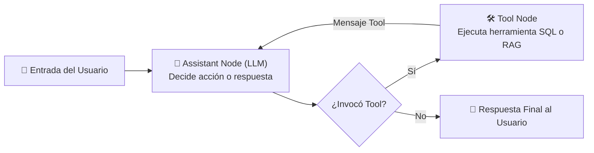

# Enfoques de Evaluación Específicos para Agentes y Aplicaciones LLM

> **Fuente Oficial de Referencia**: [LangSmith Docs - Application-specific evaluation approaches: Evaluating an agent's final response](https://docs.langchain.com/langsmith/evaluation-approaches#evaluating-an-agent's-final-response)

Este documento sintetiza y complementa la guía oficial de arquitectura de evaluación de **LangSmith**, detallando los tres niveles de evaluación para agentes autónomos basados en LLM (**Final Response**, **Single Step** y **Trajectory**), así como enfoques para RAG, resúmenes y clasificación.

---

## 🤖 1. Anatomía de un Agente y sus 3 Niveles de Evaluación

Los agentes autónomos combinan tres componentes esenciales:
1. **Llamadas a Herramientas (*Tool Calling*)**: Capacidad del modelo para seleccionar una herramienta y generar sus argumentos.
2. **Memoria (*Memory*)**: Historial de mensajes y estado conversacional.
3. **Planificación (*Planning*)**: Descomposición de objetivos e instrucciones en el *system prompt*.

En frameworks como **LangGraph** o en arquitecturas nativas de OpenAI/Ollama (como nuestro agente Emma), el ciclo de ejecución opera como un grafo cíclico:



Este ciclo habilita **tres niveles fundamentales de evaluación**:

```
                              ┌──────────────────────────────────────────────────────────┐
                              │  3. Trajectory Evaluation (Ruta completa de pasos)       │
                              ├──────────────────────────────────────────────────────────┤
[Entrada] ──► [Paso 1: Tool] ──► [Paso 2: Tool] ──► ... ──► [Paso N: LLM] ──► [Respuesta Final]
              └──────────────┘                                                └────────────────┘
            2. Single Step Eval                                              1. Final Response Eval
```

---

## 🎯 2. Evaluación de la Respuesta Final (*Evaluating an Agent's Final Response*)

> **Sección Específica**: `https://docs.langchain.com/langsmith/evaluation-approaches#evaluating-an-agent's-final-response`

### Concepto y Filosofía
Este enfoque evalúa al agente como una **caja negra (*black box*)**. No se examina la secuencia interna de decisiones ni qué herramientas se llamaron; simplemente se evalúa si el agente **cumplió con éxito el objetivo planteado por el usuario final**.

### Componentes de la Evaluación
- **Inputs (Entradas)**: La pregunta del usuario (`question`) y opcionalmente el catálogo de herramientas disponibles.
- **Outputs (Salidas)**: El texto final generado por el agente (`response` o `answer`).
- **Evaluadores Típicos**:
  - **LLM-as-a-Judge**: Un modelo evaluador califica si la respuesta resuelve la consulta, mantiene un tono adecuado y no alucina (ej. [`eval_llm_judge.py`](file:///f:/Cursos_code/LANGCHAIN/Building_Releable_Agents/module-2/lesson-5/eval_llm_judge.py)).
  - **Evaluadores Deterministas de Código**: Reglas de palabras clave o prohibiciones de negocio (ej. [`eval_stock_policy.py`](file:///f:/Cursos_code/LANGCHAIN/Building_Releable_Agents/module-2/lesson-4/eval_stock_policy.py)).
  - **Evaluación Pareada (A/B)**: Comparación directa entre dos versiones del agente ante la misma entrada (ej. [`eval_conciseness_pairwise.py`](file:///f:/Cursos_code/LANGCHAIN/Building_Releable_Agents/module-2/lesson-6/eval_conciseness_pairwise.py)).

### Ventajas
- **Enfoque Centrado en el Usuario**: Mide directamente la experiencia del cliente.
- **Agnóstico de la Implementación**: Si cambias el framework interno (de prompts manuales a LangGraph o AutoGen), el dataset de evaluación sigue siendo 100% válido.

### Limitaciones y Desventajas
- **Dificultad de Diagnóstico**: Si la respuesta final es incorrecta, no sabes si falló el parser SQL, la recuperación semántica o el razonamiento final.
- **Mayor Latencia y Coste**: Requiere ejecutar al agente completo de principio a fin y luego invocar al evaluador LLM.

---

## 🔬 3. Evaluación de un Solo Paso (*Evaluating a Single Step*)

### Concepto
Aísla una única llamada al LLM dentro de la trayectoria del agente para verificar si toma la decisión correcta en ese instante (ej. seleccionar la herramienta adecuada con los argumentos esperados).

### Componentes
- **Inputs**: El estado inmediatamente anterior a ese paso (la pregunta original + mensajes acumulados).
- **Outputs**: El objeto `tool_calls` generado por el modelo.
- **Evaluador**: Comparación heurística exacta (string match del nombre de la herramienta o validación de schema Pydantic de los argumentos).

### Ventajas y Desafíos
- **Alta Velocidad y Precisión**: Detecta con exactitud dónde se desvía el agente.
- **Desafío**: Crear datasets sintéticos con historias conversacionales previas completas requiere esfuerzo de captura de trazas.

---

## 🛤️ 4. Evaluación de la Trayectoria (*Evaluating an Agent's Trajectory*)

### Concepto
Evalúa la **secuencia completa de acciones y llamadas a herramientas** que el agente siguió para llegar a la respuesta.

### Estrategias de Evaluación
1. **Coincidencia Exacta de Secuencia**:
   - Comprueba si el agente ejecutó exactamente: `[query_database(PRAGMA)] -> [query_database(SELECT)] -> [search_knowledge_base]`.
   - *Desventaja*: A menudo existen múltiples caminos válidos para resolver un problema.
2. **Evaluación de Precedencia y Reglas de Negocio**:
   - Nuestro evaluador [`eval_schema_check.py`](file:///f:/Cursos_code/LANGCHAIN/Building_Releable_Agents/module-2/lesson-4/eval_schema_check.py) es un ejemplo canónico de este nivel: verifica que *antes* de ejecutar una consulta de datos SQL, haya ocurrido una inspección previa de esquema.
3. **LLM-as-a-Judge de Trayectoria Completa**:
   - Pasa todo el historial de herramientas al LLM juez para evaluar la eficiencia y evitar loops infinitos o llamadas redundantes.

---

## 📚 5. Otros Enfoques Específicos de Aplicaciones LLM

| Tipo de Aplicación | Evaluadores Recomendados | ¿Requiere Ground Truth? | Tipo de Evaluación |
| :--- | :--- | :--- | :--- |
| **RAG (Bases de Conocimiento)** | • **Document Relevance**: ¿Los fragmentos recuperados son pertinentes a la duda?<br>• **Answer Faithfulness**: ¿La respuesta está respaldada por los documentos recuperados?<br>• **Answer Correctness**: ¿Coincide con la respuesta canónica? | Parcial (solo para *Answer Correctness*) | Offline (con referencia) u Online (sin referencia con LLM-as-Judge) |
| **Resúmenes (*Summarization*)** | • Precisión fáctica (*Factual Accuracy*).<br>• Concisión y ausencia de alucinaciones. | No (múltiples redacciones válidas) | LLM-as-a-Judge y Pairwise A/B |
| **Clasificación y Etiquetado** | • Precision, Recall, F1-Score.<br>• Detección de toxicidad o intención de compra. | Sí (etiquetas ground truth) | Evaluadores de código deterministas |

---

## 🔗 6. Conexión con las Implementaciones del Módulo 2

En nuestro repositorio `Building_Releable_Agents`, cada lección aterriza de forma práctica estos conceptos:

- **Final Response**:
  - [`module-2/lesson-3/run_experiment.py`](file:///f:/Cursos_code/LANGCHAIN/Building_Releable_Agents/module-2/lesson-3/run_experiment.py): Evalúa si la respuesta final menciona la marca y cumple umbrales de tokens.
  - [`module-2/lesson-4/eval_stock_policy.py`](file:///f:/Cursos_code/LANGCHAIN/Building_Releable_Agents/module-2/lesson-4/eval_stock_policy.py): Evalúa que la respuesta final no divulgue números de stock.
  - [`module-2/lesson-5/eval_llm_judge.py`](file:///f:/Cursos_code/LANGCHAIN/Building_Releable_Agents/module-2/lesson-5/eval_llm_judge.py): Evalúa la utilidad y empatía de la respuesta final.
  - [`module-2/lesson-6/eval_conciseness_pairwise.py`](file:///f:/Cursos_code/LANGCHAIN/Building_Releable_Agents/module-2/lesson-6/eval_conciseness_pairwise.py): Evaluación pareada de concisión de respuesta final.
- **Trajectory**:
  - [`module-2/lesson-4/eval_schema_check.py`](file:///f:/Cursos_code/LANGCHAIN/Building_Releable_Agents/module-2/lesson-4/eval_schema_check.py): Evalúa que las llamadas a herramientas sigan el orden `Schema Discovery -> Query`.
