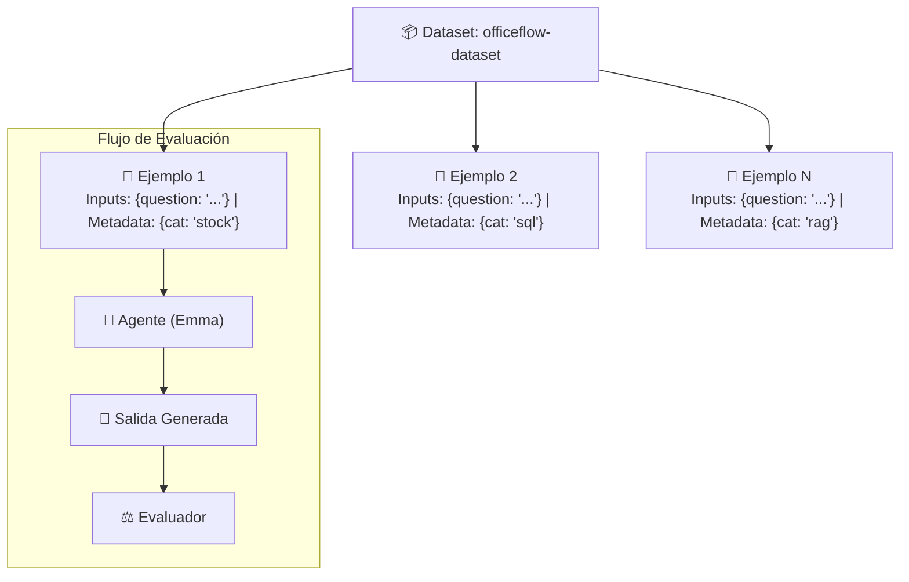

# Creación y Gestión de Datasets en LangSmith (UI y Aplicación)

> **Fuente Oficial de Referencia**: [LangSmith Docs - Create and manage datasets in the UI](https://docs.langchain.com/langsmith/manage-datasets-in-application)

Este documento sintetiza y complementa la guía oficial de LangSmith sobre cómo crear, organizar y gobernar **Datasets** desde la interfaz web (UI) y su integración en el flujo de ingeniería de agentes. Es la referencia teórica y práctica fundamental para la **Lección 2** del Módulo 2.

---

## 📌 1. Conceptos Fundamentales: Datasets y Ejemplos

En LangSmith, un **Dataset** es una colección estructurada de datos de prueba que permite ejecutar evaluaciones reproducibles a lo largo del tiempo.

Cada dataset está compuesto por **Ejemplos (*Examples*)**, los cuales contienen:

* **Inputs (Entradas)**: Los datos que se entregan al agente o pipeline (ej. `{"question": "..."}`).
* **Outputs (Salidas / Referencias Opcionales)**: La respuesta ideal esperada (*ground truth*), utilizada para comparar contra lo que el agente genere.
* **Metadata (Metadatos Opcionales)**: Diccionario de pares clave-valor que permite clasificar el ejemplo (ej. categoría, dificultad, fecha de captura, tags).



---

## 🚀 2. Métodos para Crear Datasets y Agregar Ejemplos

LangSmith ofrece **7 formas diferentes** de construir y nutrir un dataset, adaptándose a cada etapa del ciclo de vida del agente:

| Método | Origen | Caso de Uso Ideal |
| :--- | :--- | :--- |
| **1. Manual desde Traces** | `Tracing Projects` | Convertir errores reales de producción en casos de prueba. |
| **2. Automático por Reglas** | `Automation Rules` | Enviar a un dataset todas las trazas con feedback negativo (👍/👎). |
| **3. Desde Annotation Queues** | `Annotation Queues` | Curaduría y corrección humana antes de agregar al dataset. |
| **4. Desde el Playground** | `Playground` | Prototipado rápido y pruebas interactivas de prompts. |
| **5. Importar CSV o JSONL** | Archivo local | Cargar el *Golden Dataset* del equipo (ej. `officeflow-dataset.csv`). |
| **6. Desde Cero en la UI** | Página Datasets | Creación manual de datasets estructurados con esquema JSON. |
| **7. Ejemplos Sintéticos con IA** | Generador LLM | Escalar la cobertura del dataset con datos sintéticos guiados. |

---

### 1. Manualmente desde un Proyecto de Trazas (`Tracing Projects`)

Cuando tu agente está en producción o en pruebas, puedes convertir trazas destacadas en ejemplos del dataset:

* **Desde la tabla de Runs:** Selecciona múltiples ejecuciones con las casillas de verificación y haz clic en **Add to Dataset** en la barra inferior.
* **Desde el detalle individual del Run:** En la vista detallada de la ejecución, haz clic en **Add to** -> **Dataset** en la esquina superior derecha. Aquí puedes inspeccionar transformaciones y editar los datos antes de guardarlos.
* **Desde Threads completos (Conversaciones multi-turno):**
  * Puedes seleccionar hasta **100 threads** a la vez en la pestaña **Threads**.
  * **Diferencia clave:** En lugar de crear un ejemplo por cada mensaje, el thread completo se guarda como **un único ejemplo** que contiene el historial conversacional completo (sin reference output por defecto).

### 2. Automáticamente mediante Reglas de Automatización (`Automation Rules`)

Permite capturar datos de forma pasiva y continua:

* Puedes configurar reglas automáticas basadas en **Tags** o **Feedback**.
  * *Ejemplo:* Si un usuario califica una respuesta con `thumbs down` o `score < 0.5`, la regla captura automáticamente ese trace y lo envía al dataset `casos-criticos-produccion`.
* Las reglas con tipo **Runs** agregan una fila por cada ejecución coincidente.
* Las reglas con tipo **Threads** esperan a que la conversación quede inactiva antes de empaquetar el hilo completo como ejemplo.

### 3. Desde Colas de Anotación (`Annotation Queues`)

Si cuentas con expertos humanos (analistas de QA o soporte):

* Las trazas dudosas se dirigen a una cola de anotación.
* El revisor humano corrige la respuesta (`output`), agrega metadatos de diagnóstico y presiona la tecla `D` o **Add to Dataset**.
* Esto asegura que los ejemplos que entran al *Golden Dataset* tengan la máxima calidad posible.

### 4. Desde el Playground

En la herramienta interactiva de pruebas de prompts:

* Haz clic en **Set up Evaluation** -> **+ New Dataset**.
* Puedes usar **+ Row** para agregar casos de prueba directamente y ajustar las columnas de **Input** y **Reference Output**.
* *(Nota: Para datos con objetos JSON anidados complejos, se recomienda usar la página principal de Datasets).*

### 5. Importar desde Archivos CSV o JSONL (Nuestro Enfoque en la Lección 2)

* En **Datasets & Experiments**, haz clic en **+ New Dataset** -> **Import**.
* Arrastra tu archivo local (como [`officeflow-dataset.csv`](file:///f:/Cursos_code/LANGCHAIN/Building_Releable_Agents/module-2/lesson-2/officeflow-dataset.csv)).
* Mapeas qué columnas corresponden a **Input**, cuáles a **Reference Output** y cuáles a **Metadata**.

### 6. Creación desde Cero con Esquema JSON

* En **Datasets & Experiments**, selecciona la pestaña **Create from scratch**.
* Asignas un nombre único y descripción.
* Opcionalmente defines un esquema de validación JSON para forzar que todos los ejemplos cumplan una estructura estricta.

### 7. Generación de Ejemplos Sintéticos con IA (`AI-Generated Examples`)

Si tu dataset tiene pocos ejemplos y quieres expandirlo:

1. En la pestaña **Examples**, haz clic en **Add AI-Generated Examples** (icono de chispas ✨).
2. Configura tu API Key del LLM (ej. OpenAI).
3. Selecciona si quieres usar **Few-Shot Examples** (automáticos o manuales): el LLM tomará ejemplos existentes como referencia de tono y estructura.
4. Indica la cantidad de ejemplos sintéticos a generar (ej. 10, 20).
5. Revisa, edita y aprueba los ejemplos generados antes de guardarlos. LangSmith los etiquetará automáticamente con el metadato `"source": "synthetic"`.

---

## 🛠️ 3. Gestión y Gobernanza del Dataset

Una vez creado el dataset, LangSmith ofrece herramientas avanzadas para gestionarlo a escala:

### A. Esquemas de Dataset (`Dataset Schema`) y Transformaciones

Los datasets almacenan objetos JSON arbitrarios, pero para evitar inconsistencias entre miembros del equipo se pueden definir esquemas basados en [JSON Schema](https://json-schema.org/):

* **Tipos predefinidos:** LangSmith incluye tipos preconstruidos como esquemas de mensajes de chat (`Chat Model schema`).
* **Transformaciones Automáticas:** Al ingresar un ejemplo, LangSmith puede transformarlo en tiempo real (por ejemplo, convertir objetos de mensaje de LangChain al formato estándar de OpenAI messages).

### B. Partición de Datos (*Dataset Splits*)

Al igual que en machine learning tradicional (Train / Dev / Test), puedes dividir tu dataset:

1. Selecciona ejemplos en la tabla.
2. Haz clic en **Add to Split**.
3. Asigna nombres como `test`, `edge-cases`, `regression-v2`, `sql-queries`.
4. Al correr experimentos con el SDK (`evaluate()`), puedes indicar qué split evaluar:

   ```python
   evaluate(agent, data="officeflow-dataset", split="edge-cases")
   ```

### C. Metadatos de Ejemplos (*Metadata*)

Cada fila puede tener metadatos editables (clave/valor):

* Permiten categorizar preguntas: `{"category": "stock_policy", "difficulty": "hard"}`.
* Al analizar los resultados del experimento en la UI de LangSmith, puedes **agrupar (*group by*) por metadatos** para ver si el agente falla más en una categoría específica que en otra.

### D. Filtrado y Búsqueda

En la parte superior de la tabla de ejemplos puedes combinar filtros:

* **Filter by split:** Ver solo el subconjunto `test` o `eval`.
* **Filter by metadata:** Filtrar por pares clave-valor (ej. `category == "returns"`).
* **Full-text search:** Búsqueda textual sobre las preguntas y respuestas.

---

## 🎯 4. Conexión Directa con el Módulo 2 de OfficeFlow

En este curso, implementamos estos conceptos tanto por interfaz como por código:

| Concepto de LangSmith | Implementación en Nuestro Proyecto |
| :--- | :--- |
| **Dataset Name** | `officeflow-dataset` |
| **Tipo de Dataset** | **Key-Value** (`inputs={"question": "..."}`) |
| **Fuente de Datos** | [`officeflow-dataset.csv`](file:///f:/Cursos_code/LANGCHAIN/Building_Releable_Agents/module-2/lesson-2/officeflow-dataset.csv) (25 preguntas clave) |
| **Script de Automatización (SDK)** | [`upload_dataset.py`](file:///f:/Cursos_code/LANGCHAIN/Building_Releable_Agents/module-2/lesson-2/upload_dataset.py) |
| **Consumo en Experimentos** | `run_experiment.py` (Lecciones 3, 5 y 6) mediante `evaluate()` |

---

> [!TIP]
> **Recomendación de Flujo de Trabajo:**
> 1. Usa [`upload_dataset.py`](file:///f:/Cursos_code/LANGCHAIN/Building_Releable_Agents/module-2/lesson-2/upload_dataset.py) para crear tu línea base de 25 preguntas rápidamente.
> 2. Entra a [smith.langchain.com/datasets](https://smith.langchain.com/datasets) para inspeccionar los ejemplos y familiarizarte con las opciones de splits y metadatos explicadas en esta guía.
