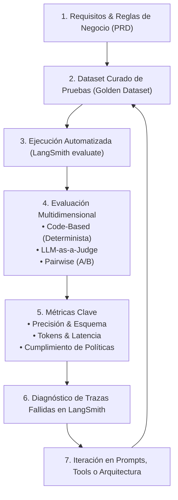

# Módulo 2 - Lección 1: Evaluación de Agentes (`Evaluating Agents`)

Bienvenido a la primera lección del **Módulo 2: Evaluación** del curso *Building Reliable Agents* de LangChain Academy.

En este módulo pasarás de la **observabilidad reactiva** (inspeccionar qué hizo el agente después de que falló) a la **evaluación proactiva y sistemática** (prevenir regresiones y medir con rigor científico si una nueva versión del agente supera a la anterior).

---

## 🎯 1. ¿Por Qué Fallan las Pruebas Manuales (*Vibe Checks*)?

Al construir agentes de IA (como **Emma** en OfficeFlow), el primer impulso común es interactuar manualmente en una consola o chat:
- Haces una o dos preguntas ("¿tienen papel?", "¿cuánto cuesta el envío?").
- Lees la respuesta, te parece razonable y asumes que el agente "funciona bien".

Este enfoque se conoce en la industria como **Vibe Check** (evaluación por intuición o sensación) y es una de las principales causas del fracaso de aplicaciones de LLMs en producción:

1. **Naturaleza Estocástica**: Un LLM no produce exactamente la misma respuesta cada vez; cambiar una palabra en el system prompt puede mejorar una consulta pero romper silenciosamente diez casos críticos.
2. **Ceguera de Regresión**: Al optimizar a Emma para ser más concisa (v5), ¿cómo sabes si accidentalmente dejó de aplicar la política de stock (v3) o si empezó a alucinar tablas SQL (v2)?
3. **Inviabilidad de Escala**: Nadie puede probar manualmente 100 escenarios antes de cada despliegue.

> [!IMPORTANT]
> **La Confiabilidad requiere Medición**: Si no puedes medir de forma reproducible el desempeño de tu agente con un dataset y métricas automáticas, no puedes garantizar su fiabilidad en producción.

---

## 🔄 2. El Ciclo de Evaluación de Agentes (*The Evaluation Flywheel*)

El desarrollo confiable de agentes sigue un ciclo continuo e iterativo:

---

## ⚖️ 3. Las Tres Familias de Evaluadores en LangSmith

Para evaluar un agente de manera exhaustiva, se combinan tres tipos de evaluadores complementarios:

| Tipo de Evaluador | ¿Cómo funciona? | Casos de Uso en Emma | Coste / Latencia | Lección del Módulo |
| :--- | :--- | :--- | :--- | :--- |
| **1. Code-based (Determinista)** | Código Python puro (`regex`, `asserts`, chequeo de schemas JSON y SQL). | Verificar que descubra el esquema SQL antes de consultar; comprobar que **nunca exponga números exactos de existencias**. | **$0 / Instantáneo** (sin LLMs). | **Lección 4** |
| **2. LLM-as-a-Judge** | Un LLM evalúa la respuesta según una rúbrica estructurada (calificaciones de 1-5 o binarias con justificación). | Evaluar empatía ante clientes enojados, claridad en explicaciones de políticas y utilidad. | Moderado (usa llamadas a LLM local o cloud). | **Lección 5** |
| **3. Pairwise (Pareada A/B)** | Compara respuestas de dos agentes (ej. v4 vs v5) ante el mismo input y dictamina cuál es superior. | Evaluar concisión: verificar si v5 dice lo mismo que v4 pero con un 60% menos de tokens. | Moderado (mitiga sesgos con barajado aleatorio). | **Lección 6** |

---

## 📊 4. Evaluación Offline vs. Online

- **Evaluación Offline (Pre-Despliegue)**:
  - Se ejecuta localmente o en pipelines de CI/CD sobre datasets fijos ([`officeflow-dataset.csv`](file:///f:/Cursos_code/LANGCHAIN/Building_Releable_Agents/module-2/lesson-2/officeflow-dataset.csv)).
  - Permite detectar regresiones antes de que los usuarios finales vean el código.
- **Evaluación Online (Post-Despliegue)**:
  - Evalúa continuamente muestras de las conversaciones reales de producción (visto en el Módulo 3).

---

## 🧮 5. Telemetría de Tokens y Latencia con Modelos Locales (Ollama)

En entornos corporativos y de desarrollo local:
- **Emma** corre sobre **Ollama** (`qwen2.5:7b` en GPU NVIDIA RTX 3060) a coste **$0**.
- Sin embargo, **el ahorro de tokens sigue siendo crítico**:
  - Menos tokens = **Menor latencia** (Time To First Token y tiempo total de generación más rápido).
  - Menor consumo de memoria VRAM en la GPU.
  - Mayor capacidad de atender múltiples peticiones concurrentes.

El módulo [`token_utils.py`](file:///f:/Cursos_code/LANGCHAIN/Building_Releable_Agents/module-2/token_utils.py) calcula de forma exacta los tokens de entrada y salida con `tiktoken` (codificación `cl100k_base`), permitiendo cuantificar objetivamente la eficiencia del agente.

---

## 🚀 6. Cómo Ejecutar el Script de Esta Lección

El script [`evaluating_agents.py`](file:///f:/Cursos_code/LANGCHAIN/Building_Releable_Agents/module-2/lesson-1/evaluating_agents.py) conecta todos estos conceptos:
1. Inicializa a Emma con la configuración de Ollama / OpenAI.
2. Carga la base de conocimiento vectorial de políticas (`nomic-embed-text`).
3. Ejecuta una consulta real bajo trazabilidad de LangSmith.
4. Mide tokens (entrada, salida), latencia en milisegundos y herramientas ejecutadas.

Para profundizar en la arquitectura teórica recomendada por LangSmith sobre cómo evaluar la respuesta final, pasos individuales y trayectorias completas, consulta:
- 📖 [Enfoques de Evaluación Específicos para Agentes (`EVALUATION_APPROACHES.md`)](file:///f:/Cursos_code/LANGCHAIN/Building_Releable_Agents/module-2/EVALUATION_APPROACHES.md)

