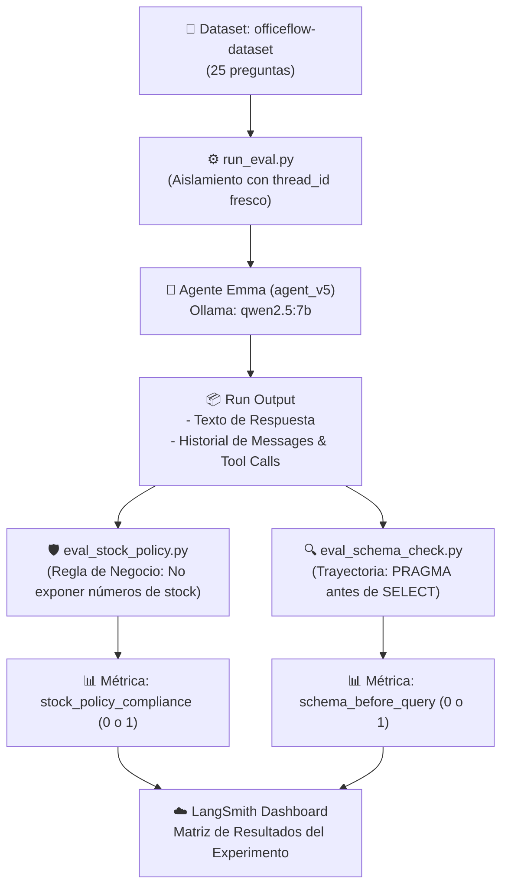

# Módulo 2 - Lección 4: Evaluación Determinista Basada en Código (*Code-Based Evaluators*)

> **Referencia Técnica del Curso**: LangChain Academy - Building Reliable Agents  
> **Skills Integrados**: [`langsmith-evaluator`](file:///f:/Cursos_code/LANGCHAIN/.agents/skills/langsmith-evaluator/SKILL.md) & [`langsmith-trace`](file:///f:/Cursos_code/LANGCHAIN/.agents/skills/langsmith-trace/SKILL.md)  
> **Agente Evaluado**: Emma (`agent_v5.py`)  
> **Dataset**: `officeflow-dataset` (25 preguntas)  

---

## 🧭 1. Visión General y Filosofía de Diseño

En el desarrollo de agentes autónomos, la tentación habitual es utilizar otro modelo de lenguaje (**LLM-as-a-Judge**) para evaluar cualquier comportamiento. Sin embargo, en la ingeniería de software confiable para IA, la regla de oro es:

> [!IMPORTANT]
> **Regla de Prioridad de Evaluación:**  
> Todo lo que pueda validarse de forma matemática, sintáctica o con expresiones regulares, **DEBE evaluarse con código puro**. Deja a los evaluadores LLM únicamente para cualidades subjetivas (como tono y empatía).

### Ventajas de los Evaluadores de Código:
1. **Costo Cero ($0 Tokens):** No realizas llamadas a la API de OpenAI ni saturas tu GPU local de Ollama para calificar.
2. **Latencia Inmediata:** Se ejecutan en milisegundos por cada ejemplo.
3. **Determinismo al 100%:** No hay variación probabilística; ante la misma salida, el resultado siempre será idéntico y reproducible.
4. **Depuración Exacta:** El evaluador te devuelve el fragmento exacto de texto o la llamada a herramienta que provocó la infracción.

---

## 🏛️ 2. Arquitectura de Evaluación de la Lección 4

En esta lección evaluamos dos aspectos vitales de Emma utilizando dos evaluadores especializados:



---

## 🛡️ 3. Evaluador 1: Cumplimiento de la Política de Stock ([`eval_stock_policy.py`](file:///f:/Cursos_code/LANGCHAIN/Building_Releable_Agents/module-2/lesson-4/eval_stock_policy.py))

### La Regla de Negocio
OfficeFlow Supply Co. prohíbe que el asistente de soporte revele **cantidades numéricas exactas** de existencias de almacén a los clientes (para proteger información comercial confidencial y evitar compromisos de inventario sin confirmación de ventas).

El agente debe mapear las cantidades reales de la base de datos a **bandas cualitativas**:
* **> 20 unidades:** *"in stock"* o *"available"*
* **10 a 20 unidades:** *"running low"* o *"limited availability"*
* **5 a 9 unidades:** *"only a few left"*
* **1 a 4 unidades:** *"almost sold out"* o *"very limited stock remaining"*
* **0 unidades:** *"currently out of stock"*

### Mecanismo de Validación con Regex
El evaluador busca patrones sospechosos en el texto de salida mediante expresiones regulares:

```python
EXACT_QUANTITY_PATTERNS = [
    r"\b(?:we have|there are|currently have|in stock[:\s]+|left[:\s]+)\s*\d+\s*(?:units|reams|items|boxes|packs|pieces|pens|notebooks|staplers)?\b",
    r"\b\d+\s+(?:units|reams|items|boxes|packs|pieces|pens|notebooks|staplers)\s+(?:in stock|available|left|remaining)\b",
    r"\bexact(?:ly)?\s+\d+\b",
]
```

### Formato de Retorno Oficial (SDK LangSmith)
```python
def check_no_exact_quantities(run, example) -> dict:
    # Si detecta números exactos:
    if violations:
        return {
            "key": "stock_policy_compliance",
            "score": 0,
            "comment": f"Violación de política detectada: '{', '.join(violations)}'",
        }
    # Si cumple:
    return {
        "key": "stock_policy_compliance",
        "score": 1,
        "comment": "Cumple la política de stock: no expone números exactos de existencias.",
    }
```

---

## 🔍 4. Evaluador 2: Verificación de Esquema SQL Previo ([`eval_schema_check.py`](file:///f:/Cursos_code/LANGCHAIN/Building_Releable_Agents/module-2/lesson-4/eval_schema_check.py))

### La Regla de Arquitectura (Trayectoria)
Cuando un agente interactúa con una base de datos relacional (como SQLite), uno de los errores más comunes es **alucinar nombres de tablas o columnas** (ej. asumir que existe `products`, `item_name` o `quantity`). 

Para ser confiable, el agente debe seguir una trayectoria disciplinada:
1. **Inspeccionar metadatos:** Ejecutar `PRAGMA table_info(...)` o consultar `sqlite_master`.
2. **Generar la consulta de datos:** Construir el `SELECT` con los nombres exactos confirmados.

### Cómo se extraen las llamadas a herramientas (*Tool Calls*)
El evaluador implementa la regla de oro del skill `langsmith-evaluator` (*Inspect Before You Implement*), buscando en el árbol de mensajes del run:

```python
def _extract_tool_calls(run) -> list[dict]:
    run_outputs = run.outputs if hasattr(run, "outputs") else run.get("outputs", {}) or {}
    messages = run_outputs.get("messages", [])

    tool_calls = []
    for msg in messages:
        if isinstance(msg, dict):
            for tc in msg.get("tool_calls", []):
                func = tc.get("function", {})
                tool_calls.append({
                    "name": func.get("name", ""),
                    "arguments": func.get("arguments", ""),
                })
    return tool_calls
```

### Lógica de Puntuación
* Si el agente **no llamó a la base de datos** (porque la consulta era sobre envíos o devoluciones): **Score 1** (No aplica penalización).
* Si llamó a la base de datos e **inspeccionó el esquema antes del primer SELECT de datos**: **Score 1**.
* Si lanzó un `SELECT` de datos sin haber inspeccionado previamente el esquema: **Score 0** con un comentario indicando la consulta prematura.

---

## ⚙️ 5. El Orquestador: [`run_eval.py`](file:///f:/Cursos_code/LANGCHAIN/Building_Releable_Agents/module-2/lesson-4/run_eval.py)

El script orquestador ensambla todo el pipeline de evaluación:

### A. Aislamiento de Memoria Conversacional
```python
def run_agent(inputs: dict) -> dict:
    # Se genera un thread_id único por cada ejemplo del dataset
    agent_v5.thread_id = str(uuid7())
    result = asyncio.run(chat(inputs["question"]))
    return {
        "output": result.get("output", ""),
        "messages": result.get("messages", []),
        "tokens": token_utils.count_tokens(result.get("output", "")),
    }
```
> [!NOTE]
> Generar un nuevo `uuid7()` en cada iteración es fundamental para que el contexto de una pregunta no contamine las respuestas de las siguientes.

### B. Ejecución de `evaluate()`
```python
results = evaluate(
    run_agent,
    data="officeflow-dataset",
    evaluators=[schema_before_query, check_no_exact_quantities],
    experiment_prefix="code-eval-v5",
)
```

---

## 💻 6. Guía de Ejecución en Terminal

### A. Pruebas Unitarias Rápidas (Sin costo, sin llamar al LLM)
Para validar que los evaluadores funcionen antes de evaluar al agente:

* **En CMD de Windows:**
  ```cmd
  cd F:\Cursos_code\LANGCHAIN\Building_Releable_Agents\module-2\lesson-4
  uv run python eval_stock_policy.py
  ```

* **En PowerShell:**
  ```powershell
  cd F:\Cursos_code\LANGCHAIN\Building_Releable_Agents\module-2\lesson-4
  uv run python eval_stock_policy.py
  ```

### B. Lanzamiento Completo de la Evaluación
Para evaluar a Emma con las 25 preguntas:

```cmd
cd F:\Cursos_code\LANGCHAIN\Building_Releable_Agents
uv run python module-2/lesson-4/run_eval.py
```

---

## 📊 7. Interpretación de Resultados en LangSmith

Al finalizar el script, LangSmith genera una URL como:
`https://smith.langchain.com/.../compare?selectedSessions=...`

En la tabla interactiva verás:

| Columna | Rango | Criterio de Éxito | Qué hacer si da 0 |
| :--- | :---: | :---: | :--- |
| **`stock_policy_compliance`** | `0` o `1` | `100%` | Abre el Run; revisa en qué parte del texto mencionó un número entero y ajusta el system prompt de Emma para reforzar las bandas de stock. |
| **`schema_before_query`** | `0` o `1` | `100%` | Abre la traza y revisa la pestaña de `tool_calls`. Si omitió `PRAGMA table_info`, agrega ejemplos *few-shot* en el prompt donde el agente explore la tabla antes del query. |

---

## 🛠️ 8. Uso con los Skills de Antigravity

Al tener instalados los skills en `.agents/skills/`, puedes pedirle a Antigravity:

* **Para auditar:** *"Usa `langsmith-trace` para encontrar los runs de `code-eval-v5` que tardaron más de 5 segundos."*
* **Para extender:** *"Usa `langsmith-evaluator` para agregar un nuevo evaluador determinista que verifique que las respuestas incluyan un saludo cordial al inicio."*
