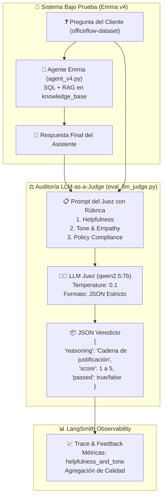

# 🎓 Clase Magistral: Módulo 2 - Lección 5

## *"Evaluación Cualitativa con LLM-as-a-Judge"*

> **Curso Oficial**: [LangChain Academy - Building Reliable Agents: Lesson 5 - Eval 2: LLM-as-Judge](https://academy.langchain.com/courses/take/building-reliable-agents/multimedia/72670191-lesson-5-eval-2-llm-as-judge)  
> **Guía Técnica de la Lección**: [`LESSON_5_COMPLETE_GUIDE.md`](file:///f:/Cursos_code/LANGCHAIN/Building_Releable_Agents/module-2/lesson-5/LESSON_5_COMPLETE_GUIDE.md)  
> **Evaluador Implementado**: [`eval_llm_judge.py`](file:///f:/Cursos_code/LANGCHAIN/Building_Releable_Agents/module-2/lesson-5/eval_llm_judge.py)  
> **Orquestador del Experimento**: [`run_experiment.py`](file:///f:/Cursos_code/LANGCHAIN/Building_Releable_Agents/module-2/lesson-5/run_experiment.py)  
> **Agente Evaluado**: Emma v4 ([`agent_v4.py`](file:///f:/Cursos_code/LANGCHAIN/Building_Releable_Agents/officeflow-agent/agent_v4.py))  

---

## 👨‍🏫 1. Introducción Pedagógica: La Frontera del Software Tradicional

Estimado estudiante, bienvenido a la **Lección 5**.

En la [Lección 4](file:///f:/Cursos_code/LANGCHAIN/Building_Releable_Agents/module-2/lesson-4/LESSON_4_COMPLETE_GUIDE.md), construimos evaluadores deterministas basados en código Python (*code-based evaluators*):

```python
def check_stock_policy(run, example):
    # Expresión regular que detecta si el agente filtró números de stock prohibidos
    ...
```

Ese evaluador es perfecto para **reglas duras**:

* Si devuelve un número de stock, falla (`score = 0`).
* Si oculta el inventario y da una respuesta cualitativa, aprueba (`score = 1`).
* Costo de ejecución: **$0.00**.
* Latencia: **0.1 milisegundos**.

### ⚠️ El Gran Problema: La Cualidad Humana

Pero ahora imagina este escenario de producción en **OfficeFlow Supply Co.**:
Un cliente escribe furioso porque su pedido llegó roto. El agente responde:
> *"Su pedido se rompió. No tenemos stock. Mande correo a soporte."*

Desde el punto de vista del código de la Lección 4:

* ¿Filtró números de stock? **No.** (Aprobado ✅)
* ¿Ejecutó SQL correctamente? **Sí.** (Aprobado ✅)

Sin embargo, para cualquier ser humano, esa respuesta es **inaceptable**: es fría, descortés, carece de empatía y genera una pésima experiencia de usuario.

> **Pregunta para reflexionar**: ¿Cómo escribes una función con `if`, `regex` o `string.contains()` que mida si una respuesta es "empática", "clara" o "educada"?  
> **Respuesta del profesor**: Es una pesadilla inviable. El lenguaje natural tiene infinitos matices, sarcasmos y sinónimos. Para evaluar lenguaje humano complejo, **necesitamos la capacidad semántica de otro modelo de lenguaje**.

Aquí nace el patrón **LLM-as-a-Judge**.

---

## ⚖️ 2. Anatomía del Patrón LLM-as-a-Judge

El patrón consiste en desacoplar el **agente que produce la solución** del **agente auditor que la evalúa**.



---

## 🧠 3. Los 3 Sesgos Cognitivos del Juez y Cómo Mitigarlos

Un LLM no es un juez neutro por defecto. Si le pides simplemente *"dime si esto está bien"*, caerá en trampas cognitivas bien documentadas en la literatura de IA:

### 1. Sesgo de Longitud (*Verbosity Bias*)

* **El problema**: Los LLMs tienden a ponerle mejor calificación a respuestas largas y floridas, asumiendo que "más palabras = mejor respuesta".
* **Nuestra solución**: En la rúbrica exigimos explícitamente calificar si la respuesta fue directa y castigamos el relleno redundante (*robotic filler*).

### 2. Deriva de Puntuación (*Score Inflation & Poor Calibration*)

* **El problema**: Si solo pides un número del 1 al 5, el modelo casi siempre pondrá 4 o 5 por complacencia.
* **Nuestra solución**: **Reasoning-First Chain-of-Thought**. Le exigimos que escriba la justificación razonada *antes* o junto a la nota. Al forzarlo a argumentar qué falló, la nota se vuelve matemáticamente calibrada.

### 3. Sesgo de Auto-Reconocimiento (*Self-Enhancement Bias*)

* **El problema**: Un modelo de una familia tiende a preferir respuestas generadas por modelos de su misma familia.
* **Nuestra solución**: El juez opera a ciegas (*blind evaluation*). En el prompt nunca se le informa qué modelo produjo la respuesta.

---

## 🔍 4. Análisis Detallado del Código

### A. La Rúbrica de Auditoría ([`eval_llm_judge.py`](file:///f:/Cursos_code/LANGCHAIN/Building_Releable_Agents/module-2/lesson-5/eval_llm_judge.py#L32-L49))

```python
JUDGE_PROMPT = """You are an expert QA evaluator for customer support interactions at OfficeFlow Supply Co.
Evaluate the assistant's response to the customer's question based on these criteria:
1. Helpfulness: Did it directly address the customer's request with accurate information?
2. Tone & Empathy: Was it warm, professional, and empathetic without robotic filler?
3. Policy Compliance: If unable to handle directly (returns, order tracking, technical issues), did it provide the correct department email or next steps?

Customer Question:
{question}

Assistant Response:
{response}

Respond in the following JSON format ONLY:
{
    "score": <number between 1 and 5, where 5 is excellent and 1 is completely unhelpful or rude>,
    "passed": <true if score >= 3, false otherwise>,
    "reasoning": "<brief 1-2 sentence explanation of your score>"
}"""
```

#### ¿Por qué esta rúbrica es de grado de ingeniería?

* **Rol específico**: *"You are an expert QA evaluator..."* sitúa al modelo en el marco mental de control de calidad, no de un asistente conversacional.
* **Criterios descompuestos**: No pide "evalúa la calidad", sino 3 dimensiones observables (Utilidad, Tono y Apego a Políticas).
* **Contrato de salida JSON**: Garantiza que el resultado pueda ser procesado por software sin intervención humana.

---

### B. El Evaluador Compatible con LangSmith ([`eval_llm_judge.py`](file:///f:/Cursos_code/LANGCHAIN/Building_Releable_Agents/module-2/lesson-5/eval_llm_judge.py#L52-L115))

```python
def helpfulness_and_tone_judge(run, example=None) -> dict:
    # 1. Extracción de entradas y salidas (agnóstica de objeto Run o Dict)
    inputs = run.inputs if hasattr(run, "inputs") and run.inputs else run.get("inputs", {})
    outputs = run.outputs if hasattr(run, "outputs") and run.outputs else run.get("outputs", {})

    question = str(inputs.get("question", "") or inputs.get("input", ""))
    response = str(outputs.get("answer", "") or outputs.get("output", "") or outputs.get("response", ""))

    # 2. Llamada a Ollama con SDK de OpenAI (Agnóstico / Local / Gratuito)
    completion = client.chat.completions.create(
        model=CHAT_MODEL,
        messages=[
            {"role": "system", "content": "You are a customer support quality evaluator. Always respond with valid JSON."},
            {"role": "user", "content": formatted_prompt}
        ],
        temperature=0.1,  # ❄️ Clave: máxima consistencia, mínima aleatoriedad
    )
```

#### Limpieza Defensiva de Markdown

Los LLMs locales (como Qwen o Llama) a veces agregan bloques ` ```json ... ``` `. El código incluye defensas para evitar que el parser JSON falle:

```python
if content.startswith("```"):
    content = content.split("```")[1]
    if content.startswith("json"):
        content = content[4:]
    content = content.strip()

data = json.loads(content)
```

Y retorna el contrato estándar de feedback para LangSmith:

```python
return {
    "key": "helpfulness_and_tone",
    "score": round(raw_score / 5.0, 2),  # Normalizado entre 0.0 y 1.0 para dashboards
    "comment": f"[{'PASSED' if passed else 'FAILED'}] (Score: {raw_score}/5) - {reasoning}",
}
```

---

### C. La Orquestación Híbrida ([`run_experiment.py`](file:///f:/Cursos_code/LANGCHAIN/Building_Releable_Agents/module-2/lesson-5/run_experiment.py))

Aquí se ensambla la evaluación completa sobre el dataset `officeflow-dataset` (25 preguntas):

```python
results = await aevaluate(
    chat_wrapper,
    data="officeflow-dataset",
    evaluators=[
        check_stock_policy,           # 🛡️ Lección 4: Evaluador de Código (Stock números)
        helpfulness_and_tone_judge,    # ⚖️ Lección 5: Evaluador Cualitativo LLM-as-a-Judge
    ],
    experiment_prefix="emma-v4-eval",
    max_concurrency=1,                # 🏎️ 1 a la vez para no saturar tu GPU local RTX 3060
)
```

---

## 📊 5. Comparativa Resumida: Código vs LLM-as-a-Judge

| Dimensión | Evaluador de Código (Lección 4) | Evaluador LLM-as-a-Judge (Lección 5) |
| :--- | :--- | :--- |
| **Herramienta** | Expresiones regulares, Python AST, SQL parser | Prompt estructurado + LLM (`qwen2.5:7b`) |
| **Objetivo** | Reglas binarias exactas (ej. no revelar inventario) | Subjetividad humana (empatía, claridad, utilidad) |
| **Costo Computacional** | Prácticamente 0 | Invocación de tokens al modelo |
| **Velocidad** | < 1 milisegundo | ~1 a 3 segundos por caso |
| **Varianza** | 0% (completamente determinista) | Muy baja con `temperature = 0.1` |
| **Rol en Producción** | Primer filtro de seguridad | Calificación de calidad y satisfacción del usuario |

---

## 🚀 6. Guía Rápida de Comandos para la Terminal

Para verificar y correr esta lección en tu entorno:

```bash
# 1. Probar el juez de forma unitaria (con ejemplos prefabricados)
uv run python module-2/lesson-5/eval_llm_judge.py

# 2. Correr el experimento completo en LangSmith con el agente Emma v4 y 25 casos
uv run python module-2/lesson-5/run_experiment.py
```

---

## 🎓 Conclusión del Profesor

> *"La confiabilidad de un agente nunca depende de un único tipo de prueba. Los sistemas de IA de clase mundial combinan **evaluadores de código deterministas** como escudo de seguridad, y **evaluadores LLM-as-a-Judge** como auditor de experiencia humana. La Lección 5 te da el puente definitivo entre ambos mundos."*
