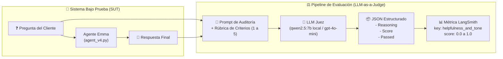

# Módulo 2 - Lección 5: Evaluación Cualitativa con LLM-as-a-Judge

> **Referencia Oficial del Curso**: [LangChain Academy - Building Reliable Agents: Lesson 5 - Eval 2: LLM-as-Judge](https://academy.langchain.com/courses/take/building-reliable-agents/multimedia/72670191-lesson-5-eval-2-llm-as-judge)  
> **Skills de Antigravity Integrados**: [`langsmith-evaluator`](file:///f:/Cursos_code/LANGCHAIN/.agents/skills/langsmith-evaluator/SKILL.md) & [`langsmith-trace`](file:///f:/Cursos_code/LANGCHAIN/.agents/skills/langsmith-trace/SKILL.md)  
> **Agente Evaluado**: Emma (`agent_v4.py`)  
> **Evaluador Implementado**: [`eval_llm_judge.py`](file:///f:/Cursos_code/LANGCHAIN/Building_Releable_Agents/module-2/lesson-5/eval_llm_judge.py) (`helpfulness_and_tone_judge`)  
> **Dataset**: `officeflow-dataset` (25 preguntas)  
> **Orquestador**: [`run_experiment.py`](file:///f:/Cursos_code/LANGCHAIN/Building_Releable_Agents/module-2/lesson-5/run_experiment.py)  

---

## 👨‍🏫 1. Clase Magistral: Fundamentos de LLM-as-a-Judge

Estimado estudiante, bienvenido a la **Lección 5**. En la lección anterior ([Lección 4](file:///f:/Cursos_code/LANGCHAIN/Building_Releable_Agents/module-2/lesson-4/LESSON_4_COMPLETE_GUIDE.md)), aprendimos a construir **evaluadores deterministas basados en código**. Vimos que para verificar reglas duras (como asegurarse de que el agente no divulgue números de stock o que consulte el esquema antes de lanzar un `SELECT`), las expresiones regulares y los algoritmos en Python son insuperables: tienen coste cero, latencia en milisegundos y reproducibilidad matemática al 100%.

Sin embargo, el software impulsado por Inteligencia Artificial tiene una dimensión que el software tradicional jamás tuvo: **la calidad subjetiva del lenguaje natural**.

### ¿Por qué el código puro fracasa ante cualidades humanas?
Imagina que te pido escribir una función en Python con expresiones regulares para responder a estas preguntas:
* *¿Fue la respuesta de Emma genuinamente empática ante un cliente enojado por un retraso de entrega?*
* *¿Explicó la política de devoluciones con claridad meridiana o utilizó tecnicismos confusos?*
* *¿Fue la respuesta concisa y al grano, o dio rodeos innecesarios para parecer inteligente?*

Si intentas evaluar esto con `regex` o conteo de palabras, caerás en una trampa de infinitas reglas frágiles que se romperán ante cualquier sinónimo. **Aquí es donde entra el patrón LLM-as-a-Judge**.

---

## ⚖️ 2. ¿Qué es el Patrón LLM-as-a-Judge?

El patrón **LLM-as-a-Judge** consiste en utilizar un Modelo de Lenguaje para evaluar, calificar y justificar la calidad de las entradas y salidas de otro agente de IA.



### Los Sesgos del Juez (*Judge Biases*) y Cómo Mitigarlos
Un modelo de lenguaje no es un árbitro perfecto por naturaleza. Los investigadores de LangChain y la literatura científica identifican 4 sesgos principales en los jueces LLM:

1. **Sesgo de Verbosidad (*Verbosity Bias*)**: Los LLMs tienden a otorgar mayores calificaciones a respuestas más largas, confundiéndolas erróneamente con respuestas "completas".
2. **Sesgo de Posición (*Position Bias*)**: En evaluaciones pareadas (A vs B), los modelos favorecen frecuentemente a la primera opción presentada.
3. **Sesgo de Auto-Reconocimiento (*Self-Enhancement Bias*)**: Modelos de una familia (ej. GPT-4) tienden a calificar mejor respuestas redactadas por modelos de su misma familia.
4. **Falta de Calibración (*Poor Calibration*)**: Si solo le pides una nota del 1 al 5 sin justificación, el modelo suele concentrar todas sus notas en 4 o 5 (inflación de notas).

### La Solución de Ingeniería: Los 3 Pilares del Prompt Juez Confiable
Para mitigar estos sesgos y obtener evaluaciones consistentes, nuestro evaluador [`eval_llm_judge.py`](file:///f:/Cursos_code/LANGCHAIN/Building_Releable_Agents/module-2/lesson-5/eval_llm_judge.py) implementa:

1. **Persona Específica y Restringida**: Asigna al juez el rol de auditor de control de calidad (*QA Evaluator*) con límites claros.
2. **Rúbrica Descompuesta en Criterios Concretos**:
   * *Helpfulness*: ¿Resolvió la duda con datos exactos?
   * *Tone & Empathy*: ¿Fue cordial sin frases robóticas?
   * *Policy Compliance*: ¿Derivó al departamento adecuado (`returns@officeflow.com`) si no podía procesarlo directamente?
3. **Razonamiento Primero (*Reasoning-First Chain-of-Thought*)**: El esquema JSON obliga al modelo a generar el campo `"reasoning"` **antes** de emitir el campo numérico `"score"`. Esto fuerza al LLM a computar la justificación en sus capas de atención antes de fijar la calificación.

---

## 🔬 3. Deconstrucción del Código de la Lección 5

### A. El Evaluador: [`eval_llm_judge.py`](file:///f:/Cursos_code/LANGCHAIN/Building_Releable_Agents/module-2/lesson-5/eval_llm_judge.py)

Observemos cómo se estructura el prompt y el procesamiento defensivo:

```python
JUDGE_PROMPT = """You are an expert QA evaluator for customer support interactions at OfficeFlow Supply Co.
Evaluate the assistant's response to the customer's question based on these criteria:
1. Helpfulness: Did it directly address the customer's request with accurate information?
2. Tone & Empathy: Was it warm, professional, and empathetic without robotic filler?
3. Policy Compliance: If unable to handle directly (returns, order tracking, technical issues), did it provide the correct department email or next steps?

Customer Question:
{question}

Assistant Response:
{response}

Respond in the following JSON format ONLY:
{{
    "score": <number between 1 and 5, where 5 is excellent and 1 is completely unhelpful or rude>,
    "passed": <true if score >= 3, false otherwise>,
    "reasoning": "<brief 1-2 sentence explanation of your score>"
}}"""
```

#### Anatomía de la Función Evaluadora:
```python
def helpfulness_and_tone_judge(run, example=None) -> dict:
    # 1. Extracción defensiva: compatible con RunTree y dicts (LangSmith SDK)
    inputs = run.inputs if hasattr(run, "inputs") and run.inputs else run.get("inputs", {})
    outputs = run.outputs if hasattr(run, "outputs") and run.outputs else run.get("outputs", {})

    question = str(inputs.get("question", "") or inputs.get("input", ""))
    response = str(outputs.get("answer", "") or outputs.get("output", "") or outputs.get("response", ""))

    # 2. Invocación al LLM con baja temperatura (0.1 para reproducibilidad)
    completion = client.chat.completions.create(
        model=CHAT_MODEL,
        messages=[
            {"role": "system", "content": "You are a customer support quality evaluator. Always respond with valid JSON."},
            {"role": "user", "content": formatted_prompt}
        ],
        temperature=0.1,
    )

    # 3. Limpieza de bloques ```json ... ``` devueltos por LLMs locales de Ollama
    content = completion.choices[0].message.content.strip()
    if content.startswith("```"):
        content = content.split("```")[1]
        if content.startswith("json"):
            content = content[4:]
        content = content.strip()

    # 4. Normalización para el estándar de LangSmith (0.0 a 1.0)
    data = json.loads(content)
    raw_score = data.get("score", 3)
    normalized_score = round(raw_score / 5.0, 2)
    reasoning = data.get("reasoning", "Evaluación completada")

    return {
        "key": "helpfulness_and_tone",
        "score": normalized_score,
        "comment": f"Calificación: {raw_score}/5. Motivo: {reasoning}",
    }
```

---

### B. El Orquestador del Experimento: [`run_experiment.py`](file:///f:/Cursos_code/LANGCHAIN/Building_Releable_Agents/module-2/lesson-5/run_experiment.py)

El script orquestador conecta las tres piezas:
1. **Target**: La función `chat_wrapper` que envuelve al agente `agent_v4`.
2. **Dataset**: El conjunto de pruebas `officeflow-dataset` alojado en LangSmith.
3. **Evaluators**: Nuestra lista de evaluadores `[helpfulness_and_tone_judge]`.

```python
async def chat_wrapper(inputs: dict) -> dict:
    # Aislamiento riguroso de memoria: cada pregunta recibe un thread_id único
    session_id = str(uuid7())
    agent_v4.thread_id = session_id
    question = inputs.get("question") or inputs.get("input") or str(inputs)
    result = await chat(question)
    output_text = result.get("output", "")
    return {
        "output": output_text,
        "answer": output_text,
        "response": output_text,
        "messages": result.get("messages", []),
        "thread_id": session_id,
    }
```

> [!TIP]
> **Sincronización y GPU con Ollama:**  
> Fijamos `max_concurrency=1` en `aevaluate()` para entornos locales. Al procesar pregunta por pregunta en tu GPU (NVIDIA RTX 3060), evitamos que dos llamadas simultáneas saturen la memoria VRAM de Ollama y garantizamos que no haya colisiones de hilos en `agent_v4.thread_id`.

---

## 🖥️ 4. Guía de Ejecución en Terminal

### Paso 1: Prueba Diagnóstica Unitaria (Aislada, Rápida)
Verifica que el juez LLM evalúe correctamente ejemplos positivos y negativos sin correr todo el dataset:

```bash
uv run python module-2/lesson-5/eval_llm_judge.py
```

**Salida Real Observada:**
```text
======================================================================
TEST DIAGNÓSTICO: EVALUADOR LLM-AS-A-JUDGE (helpfulness_and_tone_judge)
======================================================================
Juez usando modelo: qwen2.5:7b en http://localhost:11434/v1

1. Evaluando Respuesta Excelente (Buena atención):
   Score: 0.8 | Comentario: Calificación: 4/5. Motivo: The response was helpful by providing the correct department and email for returns, empathetic, and professional.

2. Evaluando Respuesta Deficiente (Mala atención):
   Score: 0.4 | Comentario: Calificación: 2/5. Motivo: The response is not helpful as it does not provide any information on how to return a damaged product. The tone is also not empathetic or professional.

======================================================================
✅ Prueba diagnóstica finalizada.
======================================================================
```

### Paso 2: Lanzamiento del Experimento Completo en LangSmith
Evalúa las 25 preguntas de `officeflow-dataset` con el agente `agent_v4`:

```bash
uv run python module-2/lesson-5/run_experiment.py
```

---

## 📊 5. Matriz Comparativa: Lección 4 vs Lección 5

| Dimensión | Lección 4: Code-Based Eval | Lección 5: LLM-as-a-Judge |
| :--- | :--- | :--- |
| **Tipo de Evaluación** | Determinista (Regex, AST, esquemas) | Heurística / Semántica (Comprensión de lenguaje) |
| **Costo de Inferencia** | $0.00 / 0 Tokens | Tokens de entrada y salida del Juez |
| **Velocidad** | < 1 milisegundo por run | 1 a 3 segundos por run |
| **Mejor Usado Para** | Violaciones de políticas de stock, trayectorias SQL, validación de schemas JSON | Empatía, tono de marca, claridad expositiva, completitud de respuesta |
| **Métrica Resultante** | Binaria: `0` o `1` | Gradual normalizada: `0.0` a `1.0` (o escala 1-5) con justificación textual |
| **Riesgo Principal** | Falsos positivos por sinónimos | Alucinación o sesgos del modelo juez (mitigado con rúbricas estrictas) |

---

## 🎯 6. Conclusión Pedagógica

En la ingeniería de agentes de producción, **la estrategia ganadora no es elegir entre código o LLM, sino combinarlos en capas**:
1. **Filtro de Primer Nivel (Código - Lección 4)**: Rechaza de inmediato cualquier respuesta con fugas de datos confidenciales o llamadas a herramientas en orden erróneo.
2. **Filtro de Segundo Nivel (LLM Judge - Lección 5)**: Aquellas respuestas que pasan las pruebas de código son evaluadas por el juez para medir su tono y satisfacción humana.

¡Con esto dominas los dos pilares fundamentales de la evaluación de agentes de IA! En la siguiente sesión ([Lección 6](file:///f:/Cursos_code/LANGCHAIN/Building_Releable_Agents/module-2/lesson-6/eval_conciseness_pairwise.md)), aprenderás a realizar **Evaluaciones Pareadas (*Pairwise A/B*)** para enfrentar cara a cara a dos versiones distintas de Emma y medir cuál es superior.
