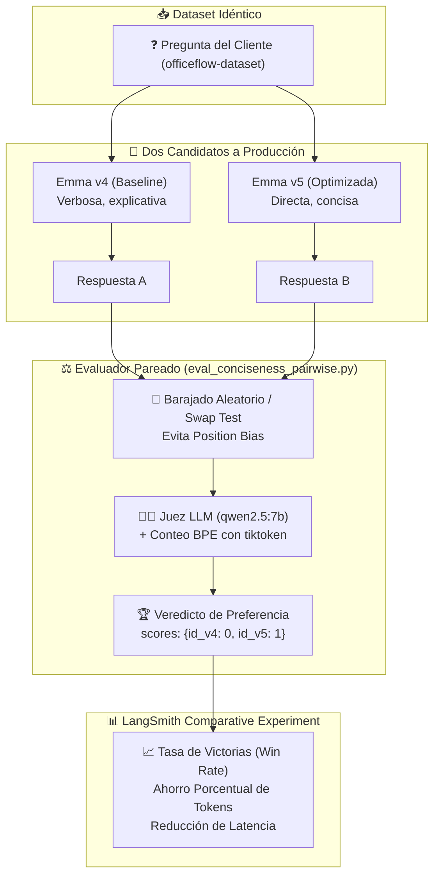

# 🎓 Clase Magistral: Módulo 2 - Lección 6

## *"Evaluación Pareada A/B con LLM-as-a-Judge (Pairwise Evaluations)"*

> **Curso Oficial**: [LangChain Academy - Building Reliable Agents: Lesson 6 - Eval 3: Pairwise](https://academy.langchain.com/courses/take/building-reliable-agents/multimedia/72804215-lesson-6-eval-3-pairwise-evaluations)  
> **Guía Técnica de la Lección**: [`LESSON_6_COMPLETE_GUIDE.md`](file:///home/juansebas7ian/Proyectos/GitHub/Building_Reliable_Agents/module-2/lesson-6/LESSON_6_COMPLETE_GUIDE.md)  
> **Evaluador Implementado**: [`eval_conciseness_pairwise.py`](file:///home/juansebas7ian/Proyectos/GitHub/Building_Reliable_Agents/module-2/lesson-6/eval_conciseness_pairwise.py)  
> **Agentes Comparados**: Emma v4 ([`agent_v4.py`](file:///home/juansebas7ian/Proyectos/GitHub/Building_Reliable_Agents/officeflow-agent/agent_v4.py)) vs Emma v5 ([`agent_v5.py`](file:///home/juansebas7ian/Proyectos/GitHub/Building_Reliable_Agents/officeflow-agent/agent_v5.py))  
> **Utilidad de Métricas y Tokens**: [`token_utils.py`](file:///home/juansebas7ian/Proyectos/GitHub/Building_Reliable_Agents/module-2/token_utils.py)  
> **Dataset**: `officeflow-dataset` (25 preguntas)  
> **Orquestadores**: [`run_pairwise_experiment.py`](file:///home/juansebas7ian/Proyectos/GitHub/Building_Reliable_Agents/module-2/lesson-6/run_pairwise_experiment.py) y [`run_agents.py`](file:///home/juansebas7ian/Proyectos/GitHub/Building_Reliable_Agents/module-2/lesson-6/run_agents.py)  

---

## 👨‍🏫 1. Introducción Pedagógica: La Gran Pregunta de Producción

Estimado estudiante, bienvenido a la **Lección 6**, la sesión culminante del Módulo 2.

Hasta ahora hemos construido dos tipos de defensas para medir la fiabilidad de nuestros agentes de IA:

1. **En la Lección 4**: Evaluadores deterministas en código Python puro (`check_stock_policy`). Reglas duras de aprobado/reprobado con latencia casi nula y coste $0.
2. **En la Lección 5**: Evaluación cualitativa individual con **LLM-as-a-Judge** (`eval_llm_judge.py`). Un modelo juzgando de forma aislada cada respuesta de nuestro agente con una nota de 1 a 5 y rúbrica JSON.

Ahora imagínate que eres el **Head of AI** en OfficeFlow Supply Co. El equipo de ingeniería acaba de crear una nueva versión del agente: **Emma v5**. 

Te acercas a tu equipo y les preguntas:
> *"¿Es Emma v5 mejor que Emma v4? ¿Debemos desplegarla hoy a producción?"*

Si utilizas el método de la Lección 5 (calificaciones absolutas de 1 a 5), te encontrarás con una barrera estadística insalvable:
* Emma v4 promedió `4.32 / 5.0`.
* Emma v5 promedió `4.38 / 5.0`.

¿Es esa diferencia de `+0.06` una mejora real de producto o es simplemente ruido estocástico del modelo juez?

---

## ⚖️ 2. Fundamentos: Del Juicio Absoluto al Juicio Comparativo

### El Problema de la Calibración Absoluta (*Calibration Drift*)
Tanto los seres humanos como los Modelos de Lenguaje sufren cuando deben asignar una **calificación numérica absoluta** en el vacío:
* ¿Qué diferencia exactamente una respuesta de `4 estrellas` frente a una de `5 estrellas`?
* La frontera es difusa y cambia según el día, la temperatura o el contexto inmediato del prompt.

### La Solución Cognitiva: Juicio Pareado (*Pairwise Comparison*)
Sin embargo, cuando colocas dos respuestas lado a lado y formulas la pregunta correcta:
> *"Entre la Respuesta A y la Respuesta B ante la misma pregunta del cliente, ¿cuál resolvió el problema con mayor claridad, concisión y sin rodeos innecesarios?"*

El grado de certeza, repetibilidad y consistencia estadística se dispara. Esto se basa en el principio psicométrico de la **Ley del Juicio Comparativo de Thurstone**: los evaluadores son mucho más precisos ordenando opciones relativas ($A > B$) que midiendo valores absolutos en una escala fija.



---

## 🚨 3. Los Peligros Ocultos: Sesgos en la Evaluación Pareada

Al diseñar un sistema de evaluación pareada, no basta con pasar dos textos a un LLM. Existen dos sesgos estructurales que debemos mitigar obligatoriamente:

### A. Sesgo de Posición (*Position Bias*)
Los LLMs tienden fuertemente a preferir la **Respuesta A** por el simple hecho de ser la primera que leen en el prompt (efecto primacía), o en otros modelos, la **Respuesta B** por ser la más reciente en la ventana de contexto (efecto recencia).

**¿Cómo lo mitigamos?**
1. **En LangSmith**: Activando `randomize_order=True`. LangSmith baraja aleatoriamente el orden en cada fila y luego remapea internamente el puntaje al `run.id` correcto.
2. **En Pruebas Rigurosas (Swap Test)**: Se evalúa primero `(A, B)` y luego se invierte `(B, A)`. Solo se declara ganador a aquel modelo que venza en ambas orientaciones; si el juez prefiere a quien esté en la primera posición, se declara un empate por inconsistencia.

### B. Sesgo de Verbosidad (*Verbosity Bias*)
Los modelos de lenguaje asocian por defecto la elocuencia y los párrafos largos con mayor "sabiduría" y "esfuerzo".

**¿Cómo lo mitigamos?**
En la Lección 6 definimos una **Rúbrica de Concisión con Guarda de Seguridad (*Guardrail*)**:
* **Definición de Concisión**: Ir directo al grano, eliminar frases cliché de cortesía excesiva (*robotic filler*) y no repetir datos.
* **Guarda de Seguridad**: Una respuesta más corta **NO es mejor si omite información crucial** (como correos oficiales, pasos de devolución o advertencias de política).

---

## 🔄 4. Caso de Estudio en OfficeFlow: Emma v4 vs Emma v5

Analicemos la evolución técnica entre ambas versiones:

| Dimensión | Emma v4 (`agent_v4.py`) | Emma v5 (`agent_v5.py`) |
| :--- | :--- | :--- |
| **Comportamiento** | Muy cortés, explicaciones largas, múltiples párrafos | Directa, resolutiva, va al grano en 1-2 oraciones |
| **Directriz de Prompt** | Prompt estándar de servicio al cliente | Regla explícita `CONCISENESS PRIORITY` |
| **Few-Shot Examples** | Diálogos extensos con saludos y despedidas elaboradas | Respuestas concisas y de alta densidad informativa |
| **Consumo de Tokens** | Alto (~40-60 tokens por respuesta simple) | Bajo (~15-30 tokens por respuesta simple) |
| **Impacto en Negocio** | Mayor costo de inferencia, lentitud percibida | ~40% de ahorro de tokens, menor latencia |

### La Instrucción Inyectada en el Prompt de Emma v5:
```markdown
CONCISENESS PRIORITY:
Your responses should be brief and to the point. Avoid unnecessary filler, repetition, 
or overly elaborate explanations. Get straight to the answer. If you can say something 
in one sentence, don't use three. Customers appreciate quick, direct answers over lengthy responses.
```

---

## 🔍 5. Deconstrucción del Código: `eval_conciseness_pairwise.py`

Veamos cómo se traduce esta teoría a código ejecutable en Python utilizando la integración dual con **Ollama Local** (`qwen2.5:7b`):

### 1. El Prompt del Juez Pareado
```python
CONCISENESS_PROMPT = """You are evaluating two responses to the same customer question.
Determine which response is MORE CONCISE while still providing all crucial information.

**Conciseness** means getting straight to the point, avoiding filler, and not repeating information.
**Crucial information** includes direct answers, necessary context, and required next steps.

A shorter response is NOT automatically better if it omits crucial information.

**Question:** {question}

**Response A:**
{response_a}

**Response B:**
{response_b}

Output your verdict as a single number ONLY:
1 if Response A is more concise while preserving crucial information
2 if Response B is more concise while preserving crucial information
0 if they are roughly equal"""
```

### 2. Medición Cuantitativa Paralela (`token_utils.py`)
No confiamos únicamente en la opinión del LLM. Medimos los tokens exactos mediante el estándar BPE (`cl100k_base` con `tiktoken`):
```python
tokens_a = token_utils.count_tokens(resp_a_text, model="qwen2.5:7b")
tokens_b = token_utils.count_tokens(resp_b_text, model="qwen2.5:7b")

tokens_saved = abs(tokens_a - tokens_b)
pct_saved = round((tokens_saved / max(tokens_a, tokens_b)) * 100, 2)
```

### 3. Asignación de Puntos compatible con LangSmith
LangSmith requiere que un evaluador comparativo devuelva un mapa de `scores` con los identificadores de ejecución:
```python
if preference == 1:
    scores = {id_a: 1, id_b: 0}  # Victoria para A
elif preference == 2:
    scores = {id_a: 0, id_b: 1}  # Victoria para B
else:
    scores = {id_a: 0, id_b: 0}  # Empate

return {
    "key": "conciseness_preference",
    "scores": scores,
    "comment": f"{verdict}. Tokens A: {tokens_a} | Tokens B: {tokens_b}. Ahorro: {tokens_saved} ({pct_saved}%)."
}
```

---

## 🧪 6. Análisis de los Experimentos de Diagnóstico

Al ejecutar el script de diagnóstico en tu máquina local:
```bash
uv run python module-2/lesson-6/eval_conciseness_pairwise.py
```

Obtuvimos dos casos de prueba sumamente reveladores que demuestran la inteligencia de la rúbrica:

### Caso 1: Emma v4 (Verbosa) vs Emma v5 (Concisa)
* **Pregunta**: *"Do you carry standard letter size copy paper?"*
* **Respuesta A (v4)**: *"Yes, we do! We carry several types of copy paper. Are you looking for standard 8.5x11 inch letter size, or do you need a specific weight or finish? I can check what we have in stock."* (47 tokens)
* **Respuesta B (v5)**: *"Yes! We carry several types. Are you looking for standard 8.5x11, or a specific weight or finish?"* (26 tokens)
* **Veredicto del Juez**: `Scores: {'A': 0, 'B': 1}` (Ganó Emma v5).
* **Interpretación del Profesor**: Ambas respuestas informan exactamente lo mismo y hacen la misma pregunta clarificadora. Pero la versión B ahorró **21 tokens (44.68%)**, eliminando el relleno innecesario.

### Caso 2: El Anti-patrón de Brevedad sin Información Crucial
* **Pregunta**: *"How do I return a damaged product?"*
* **Respuesta A (Completa)**: *"While I cannot process returns directly, our Returns Department will help you at returns@officeflow.com or 1-800-OFFICE-1 ext. 3. They typically respond within 4 business hours."* (43 tokens)
* **Respuesta B (Demasiado Breve)**: *"Email customer service."* (4 tokens)
* **Veredicto del Juez**: `Scores: {'A': 1, 'B': 0}` (Ganó la Respuesta A).
* **Interpretación del Profesor**: ¡Este es el test más importante! Aunque la Respuesta B tiene un 90% menos de tokens, el juez la castigó porque **omitió información crítica** (el correo, el teléfono y el tiempo de respuesta). La concisión nunca debe sacrificar la exactitud operativa.

---

## 🚀 7. Modos de Ejecución para el Estudiante

Tienes a tu disposición dos formas de ejecutar esta lección:

### Modo 1: Diagnóstico Local Inmediato (Recomendado para entender la lógica)
Sin necesidad de credenciales de LangSmith ni de esperar a que corran los 25 casos:
```bash
uv run python module-2/lesson-6/eval_conciseness_pairwise.py
```

### Modo 2: Experimento Pareado Completo en LangSmith
Ejecuta las dos versiones del agente sobre las 25 preguntas del dataset y calcula el Win-Rate global:
```bash
uv run python module-2/lesson-6/run_pairwise_experiment.py
```

---

## 📝 8. Conclusiones y Lecciones Clave para Producción

1. **La evaluación pareada A/B es el estándar de oro** para decidir si una nueva versión de un agente (`v5`) reemplaza a la versión previa (`v4`).
2. **Mitiga siempre el sesgo de posición**: Si no barajas aleatoriamente el orden o no realizas el swap test, tus resultados no tendrán validez estadística.
3. **Optimizar para concisión reduce costes y latencia**: Un ahorro del 30-40% en tokens de salida se traduce directamente en respuestas que aparecen el doble de rápido en la pantalla del usuario final y facturas de inferencia significativamente menores.
4. **Protege la información crucial**: La brevedad sin sustancia es un fallo crítico; tu evaluador debe verificar que los datos esenciales sigan presentes.
