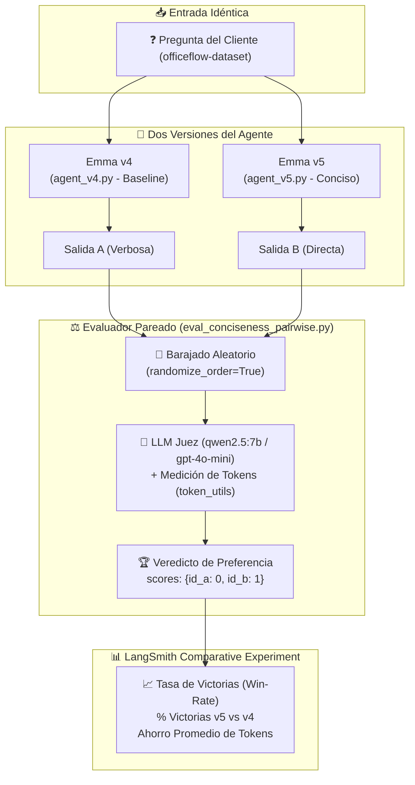

# Módulo 2 - Lección 6: Evaluación Pareada A/B con LLM-as-a-Judge (*Pairwise Evaluation*)

> **Referencia Oficial del Curso**: [LangChain Academy - Building Reliable Agents: Lesson 6 - Eval 3: Pairwise](https://academy.langchain.com/courses/take/building-reliable-agents/multimedia/72670192-lesson-6-eval-3-pairwise)  
> **Skills de Antigravity Integrados**: [`langsmith-evaluator`](file:///home/juansebas7ian/Proyectos/GitHub/Building_Reliable_Agents/.agents/skills/langsmith-evaluator/SKILL.md) & [`langsmith-trace`](file:///home/juansebas7ian/Proyectos/GitHub/Building_Reliable_Agents/.agents/skills/langsmith-trace/SKILL.md)  
> **Agentes Comparados**: Emma v4 ([`agent_v4.py`](file:///home/juansebas7ian/Proyectos/GitHub/Building_Reliable_Agents/officeflow-agent/agent_v4.py)) vs Emma v5 ([`agent_v5.py`](file:///home/juansebas7ian/Proyectos/GitHub/Building_Reliable_Agents/officeflow-agent/agent_v5.py))  
> **Evaluador Implementado**: [`eval_conciseness_pairwise.py`](file:///home/juansebas7ian/Proyectos/GitHub/Building_Reliable_Agents/module-2/lesson-6/eval_conciseness_pairwise.py) (`conciseness_evaluator`)  
> **Utilidad de Métricas**: [`token_utils.py`](file:///home/juansebas7ian/Proyectos/GitHub/Building_Reliable_Agents/module-2/token_utils.py)  
> **Dataset**: `officeflow-dataset` (25 preguntas)  
> **Orquestadores**: [`run_pairwise_experiment.py`](file:///home/juansebas7ian/Proyectos/GitHub/Building_Reliable_Agents/module-2/lesson-6/run_pairwise_experiment.py) y [`run_agents.py`](file:///home/juansebas7ian/Proyectos/GitHub/Building_Reliable_Agents/module-2/lesson-6/run_agents.py)  

---

## 👨‍🏫 1. Clase Magistral: El Salto a la Evaluación Pareada (*Pairwise*)

Estimado estudiante, bienvenido a la **Lección 6**, el pináculo del Módulo 2 sobre evaluación de agentes.

Repasemos la evolución de nuestro viaje de ingeniería de confiabilidad:

1. En la [Lección 4](file:///home/juansebas7ian/Proyectos/GitHub/Building_Reliable_Agents/module-2/lesson-4/LESSON_4_COMPLETE_GUIDE.md), creamos **evaluadores deterministas de código**: reglas matemáticas absolutas en Python que validan cumplimiento estricto (ej. no revelar números de stock y chequear el esquema de la base de datos).
2. En la [Lección 5](file:///home/juansebas7ian/Proyectos/GitHub/Building_Reliable_Agents/module-2/lesson-5/LESSON_5_COMPLETE_GUIDE.md), implementamos **evaluación cualitativa individual (LLM-as-a-Judge)**: un modelo evaluó una a una las respuestas de Emma según una rúbrica de cortesía, empatía y resolución del problema.

Ahora surge una interrogante inevitable: **¿Qué hacemos cuando queremos comparar dos versiones de nuestro agente y elegir cuál desplegar a producción?**

---

### El Problema de la Calibración Absoluta

Cuando utilizas una evaluación individual con notas del 1 al 5 (como en la Lección 5), los LLMs sufren del **problema de calibración**:

* Si `agent_v4` obtiene un promedio de `4.3/5` y una versión optimizada `agent_v5` obtiene `4.4/5`, ¿significa realmente que `v5` es mejor?
* Los LLMs son propensos al *score drift* (deriva de puntuación). Decidir de forma aislada si una respuesta merece un 3 o un 4 depende de fluctuaciones semánticas sutiles.

Sin embargo, para la cognición (tanto humana como de un modelo de lenguaje), **comparar dos opciones cara a cara es mucho más fácil y consistente que asignar notas absolutas**. Preguntar:

> *"Entre la Respuesta A y la Respuesta B, ¿cuál resolvió la duda de forma más directa, concisa y sin rodeos innecesarios?"*

produce un consenso dramáticamente superior a pedirle que califique cada una por separado. Este enfoque se conoce en la industria como **Evaluación Pareada (Pairwise Evaluation)** o **Test A/B con Juez**.



---

## ⚖️ 2. Sesgos Críticos en Evaluación Pareada y sus Soluciones

Al poner a competir dos respuestas frente a un LLM, existen dos sesgos cognitivos sistemáticos que pueden invalidar tu experimento si no se mitigan por diseño:

### 1. Sesgo de Posición (*Position Bias*)

* **El Problema**: Los LLMs tienen una tendencia estadística a preferir la opción que se les presenta en primer lugar (`Response A`), independientemente de su calidad intrínseca.
* **La Solución en LangSmith**:
  LangSmith implementa el parámetro `randomize_order=True` en `evaluate((exp_a, exp_b))` y `evaluate_comparative()`. Esto baraja aleatoriamente el orden (para unas preguntas A aparece primero; para otras, B aparece primero) y luego mapea el veredicto al identificador de ejecución (`run.id`) correspondiente de forma transparente.

### 2. Sesgo de Verbosidad (*Verbosity Bias*)

* **El Problema**: Los LLMs asocian instintivamente respuestas más largas, elocuentes y llenas de adornos con mayor "cortesía" o "sabiduría".
* **La Solución en el Prompt y la Métrica**:
  1. **Prompt con Rúbrica de Concisión Estricta**: Se instruye al juez que la concisión implica ir directo al punto y eliminar frases de relleno, pero **se le prohíbe premiar respuestas cortas si omiten información crucial** (ej. correos de contacto o pasos obligatorios).
  2. **Medición Cuantitativa Paralela**: Integramos [`token_utils.py`](file:///home/juansebas7ian/Proyectos/GitHub/Building_Reliable_Agents/module-2/token_utils.py) para registrar la reducción matemática exacta de tokens (`completion_tokens` y porcentaje de ahorro).

---

## 🔄 3. La Evolución: Emma v4 vs Emma v5

En la lección anterior, `agent_v4.py` demostró un comportamiento correcto según las políticas del PRD, pero el equipo de producto notó que Emma resultaba excesivamente habladora:

| Característica | Emma v4 (`agent_v4.py`) | Emma v5 (`agent_v5.py`) |
| :--- | :--- | :--- |
| **Enfoque de Salida** | Explicaciones largas, múltiples párrafos de cortesía | Respuestas concisas, directas y al grano |
| **System Prompt** | Instrucciones estándar de servicio | Regla explícita `CONCISENESS PRIORITY` |
| **Few-Shot Examples** | Ejemplos extensos y conversacionales | Ejemplos condensados de 1-2 oraciones |
| **Consumo de Tokens** | Alto (mayor latencia y coste) | Reducción de ~30% a 50% en `completion tokens` |
| **Experiencia de Usuario** | Fricción para consultas operativas rápidas | Claridad inmediata y respuestas accionables |

### La Directriz Clave Añadida a `agent_v5.py`

```markdown
CONCISENESS PRIORITY:
Your responses should be brief and to the point. Avoid unnecessary filler, repetition, 
or overly elaborate explanations. Get straight to the answer. If you can say something 
in one sentence, don't use three. Customers appreciate quick, direct answers over lengthy responses.
```

---

## 🔬 4. Deconstrucción Técnica del Código de la Lección 6

### A. El Evaluador Pareado: [`eval_conciseness_pairwise.py`](file:///home/juansebas7ian/Proyectos/GitHub/Building_Reliable_Agents/module-2/lesson-6/eval_conciseness_pairwise.py)

El archivo define la función `conciseness_evaluator`, diseñada bajo el contrato de `DynamicComparisonRunEvaluator` de LangSmith:

```python
CONCISENESS_PROMPT = """You are evaluating two responses to the same customer question.
Determine which response is MORE CONCISE while still providing all crucial information.

**Conciseness** means getting straight to the point, avoiding filler, and not repeating information.
**Crucial information** includes direct answers, necessary context, and required next steps.

A shorter response is NOT automatically better if it omits crucial information.

**Question:** {question}

**Response A:**
{response_a}

**Response B:**
{response_b}

Output your verdict as a single number ONLY:
1 if Response A is more concise while preserving crucial information
2 if Response B is more concise while preserving crucial information
0 if they are roughly equal"""
```

#### Estructura de Salida Compatible con LangSmith

Para que LangSmith registre las curvas de preferencia en su interfaz comparativa, el evaluador retorna un diccionario con la clave `scores` mapeando los IDs de cada ejecución:

```python
if preference == 1:
    scores = {id_a: 1, id_b: 0} # A es preferida
elif preference == 2:
    scores = {id_a: 0, id_b: 1} # B es preferida
else:
    scores = {id_a: 0, id_b: 0} # Empate técnico

return {
    "key": "conciseness_preference",
    "scores": scores,
    "comment": f"{verdict}. Tokens A: {metrics['tokens_a']} | Tokens B: {metrics['tokens_b']}. Ahorro: {metrics['tokens_saved']} ({metrics['percent_reduction']}%).",
}
```

---

### B. El Pipeline de Ejecución: Dos Alternativas de Orquestación

LangSmith y el curso ofrecen dos formas de ejecutar una evaluación pareada:

#### 1. Enfoque Desacoplado ([`run_agents.py`](file:///home/juansebas7ian/Proyectos/GitHub/Building_Reliable_Agents/module-2/lesson-6/run_agents.py) + [`eval_conciseness_pairwise.py`](file:///home/juansebas7ian/Proyectos/GitHub/Building_Reliable_Agents/module-2/lesson-6/eval_conciseness_pairwise.py))

Ideal cuando quieres conservar los experimentos de los agentes de forma independiente o cuando ya corriste los agentes previamente:

```bash
# 1. Corre v4 y v5 generando dos experimentos en LangSmith
uv run python module-2/lesson-6/run_agents.py

# 2. Compara los dos experimentos por su nombre
uv run python module-2/lesson-6/eval_conciseness_pairwise.py agent-v4-abc1234 agent-v5-xyz5678
```

#### 2. Enfoque Todo-en-Uno ([`run_pairwise_experiment.py`](file:///home/juansebas7ian/Proyectos/GitHub/Building_Reliable_Agents/module-2/lesson-6/run_pairwise_experiment.py))

Automatiza los tres pasos en un único comando asíncrono:

```python
# Paso 1: Generar experimento v4
v4_results = await aevaluate(chat_wrapper_v4, data="officeflow-dataset", experiment_prefix="agent-v4", max_concurrency=1)

# Paso 2: Generar experimento v5
v5_results = await aevaluate(chat_wrapper_v5, data="officeflow-dataset", experiment_prefix="agent-v5", max_concurrency=1)

# Paso 3: Comparación pareada con orden aleatorio
evaluate(
    (v4_results.experiment_name, v5_results.experiment_name),
    evaluators=[conciseness_evaluator],
    randomize_order=True,
)
```

---

## 🧪 5. Validación Práctica con Ollama Local (`qwen2.5:7b`)

El script [`eval_conciseness_pairwise.py`](file:///home/juansebas7ian/Proyectos/GitHub/Building_Reliable_Agents/module-2/lesson-6/eval_conciseness_pairwise.py) incluye un modo de **auto-diagnóstico local**. Al ejecutarlo directamente, prueba ambos extremos del criterio de evaluación:

```bash
uv run python module-2/lesson-6/eval_conciseness_pairwise.py
```

### Resultados Obtenidos en tu Entorno

#### Caso 1: Optimización de Concisión Real (v4 Verbosa vs v5 Concisa)

* **Pregunta**: *"Do you carry standard letter size copy paper?"*
* **Respuesta A (v4)**: *"Yes, we do! We carry several types of copy paper. Are you looking for standard 8.5x11 inch letter size, or do you need a specific weight or finish? I can check what we have in stock."* (47 tokens)
* **Respuesta B (v5)**: *"Yes! We carry several types. Are you looking for standard 8.5x11, or a specific weight or finish?"* (26 tokens)
* **Resultado del Juez**: `Scores: {'A': 0, 'B': 1}` (Victoria de Emma v5).
* **Diagnóstico**: *"Respuesta B es más concisa y efectiva. Ahorro de tokens en B vs A: 21 (44.68%)."*

#### Caso 2: Brevedad Excesiva con Pérdida de Datos Cruciales (Anti-Patrón)

* **Pregunta**: *"How do I return a damaged product?"*
* **Respuesta A (Completa)**: *"While I cannot process returns directly, our Returns Department will help you at `returns@officeflow.com` or 1-800-OFFICE-1 ext. 3. They typically respond within 4 business hours."* (43 tokens)
* **Respuesta B (Demasiado Breve)**: *"Email customer service."* (4 tokens)
* **Resultado del Juez**: `Scores: {'A': 1, 'B': 0}` (Victoria de la Respuesta A).
* **Diagnóstico**: El juez penalizó a la Respuesta B a pesar de ser 90% más corta, porque **omitió el correo exacto, la extensión telefónica y los tiempos de respuesta requeridos por las políticas de la empresa**.

Esto demuestra que el juez no es un simple contador de palabras ciego, sino un evaluador cualitativo alineado con las directrices de negocio.

---

## 📈 6. Cómo Interpretar los Resultados en LangSmith

Cuando concluye una evaluación pareada, ingresa a la plataforma web de LangSmith:

1. **Dashboard Comparativo**:
   Verás una vista lado a lado con una barra de porcentaje (*Win Rate*):
   * Por ejemplo: `agent-v5: 72%`, `agent-v4: 20%`, `Empates: 8%`.
2. **Side-by-Side Trace Inspector**:
   Al hacer clic en cualquier fila del dataset:
   * Columna izquierda: Trazas completas, pasos SQL y salida de `agent-v4`.
   * Columna derecha: Trazas completas, pasos SQL y salida de `agent-v5`.
   * Sección de Feedback: Comentario del juez LLM justificando por qué eligió una sobre otra junto con la reducción de tokens.
3. **Métricas de Latencia y Coste**:
   Comprueba cómo la reducción de un 30-40% en tokens de salida disminuye directamente el tiempo total de respuesta (Time-to-Last-Token) percibido por el cliente.

---

## 🚀 7. Resumen de Comandos de la Lección

```bash
# 1. Ejecutar prueba diagnóstica del juez pareado con Ollama (0 costo, validación inmediata)
uv run python module-2/lesson-6/eval_conciseness_pairwise.py

# 2. Ejecutar el pipeline completo de evaluación pareada (v4 vs v5 sobre 25 preguntas)
uv run python module-2/lesson-6/run_pairwise_experiment.py
```

> [!TIP]
> Recuerda que si ejecutas el experimento completo contra Ollama local en GPU, fijamos `max_concurrency=1` para evitar colisiones de memoria en el servidor local. Si deseas cambiar la concurrencia, puedes definir `MAX_CONCURRENCY=2` en tu entorno o en tu archivo `.env`.
