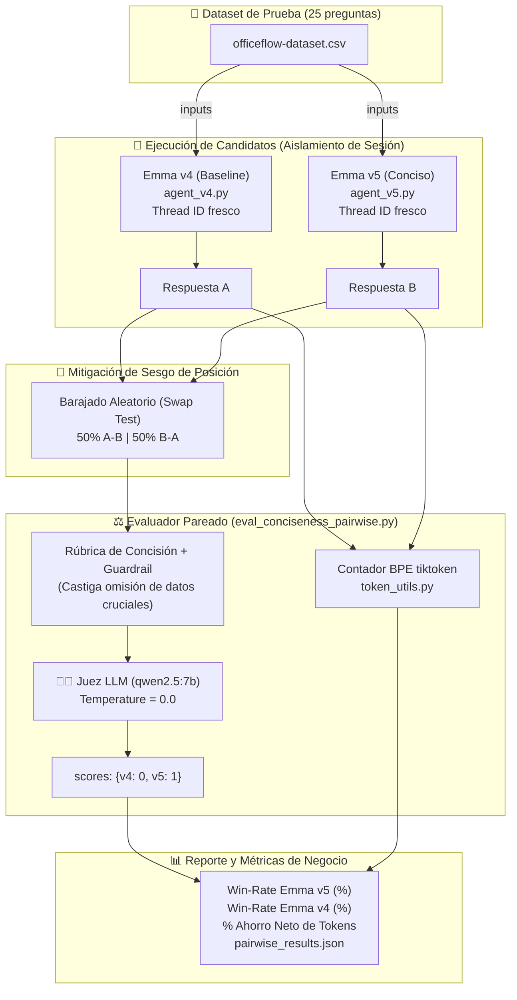

# Módulo 2 - Lección 6: Evaluación Pareada A/B con LLM-as-a-Judge (*Pairwise Evaluation*)

> **Curso Oficial**: [LangChain Academy - Building Reliable Agents: Lesson 6 - Eval 3: Pairwise](https://academy.langchain.com/courses/take/building-reliable-agents/multimedia/72804215-lesson-6-eval-3-pairwise-evaluations)  
> **Clase Magistral Pedagógica**: [`CLASE_MAGISTRAL_LECCION_6.md`](file:///home/juansebas7ian/Proyectos/GitHub/Building_Reliable_Agents/module-2/lesson-6/CLASE_MAGISTRAL_LECCION_6.md)  
> **Guía Técnica de Referencia**: [`LESSON_6_COMPLETE_GUIDE.md`](file:///home/juansebas7ian/Proyectos/GitHub/Building_Reliable_Agents/module-2/lesson-6/LESSON_6_COMPLETE_GUIDE.md)  
> **Skills de Antigravity Integrados**: [`langsmith-evaluator`](file:///home/juansebas7ian/Proyectos/GitHub/Building_Reliable_Agents/.agents/skills/langsmith-evaluator/SKILL.md)  

---

## 🤖 1. Infraestructura y Modelos de IA Utilizados

Esta lección opera de forma autónoma, privada y con coste $0 en tu máquina local a través de **Ollama** sobre GPU NVIDIA RTX 3060:

| Componente | Modelo | Endpoint | Tipo / Rol | Función en la Lección |
| :--- | :--- | :--- | :--- | :--- |
| **LLM Juez (*Pairwise Judge*)** | `qwen2.5:7b` | `http://localhost:11434/v1` | Temperature: 0.0 | Compara respuestas A vs B bajo una rúbrica de concisión y completitud |
| **Agente Base (Emma v4)** | `qwen2.5:7b` | `http://localhost:11434/v1` | Baseline | Respuestas correctas pero verbosas, con múltiples párrafos de cortesía |
| **Agente Optimizado (Emma v5)** | `qwen2.5:7b` | `http://localhost:11434/v1` | Candidato Prod | Respuestas directas al grano (`CONCISENESS PRIORITY`), reduciendo tokens |
| **Embeddings RAG** | `nomic-embed-text` | `http://localhost:11434/v1` | 768 dim | Búsqueda semántica en base de conocimientos corporativa (`knowledge_base`) |
| **Medición de Tokens** | `tiktoken` (`cl100k_base`) | Local Python | Determinista | Mide el ahorro matemático exacto de tokens entre ambas respuestas |

---

## 👨‍🏫 2. ¿Qué es la Evaluación Pareada y por qué es Superior?

En la [Lección 5](file:///home/juansebas7ian/Proyectos/GitHub/Building_Reliable_Agents/module-2/lesson-5/README.md), calificamos cada respuesta de forma aislada con notas del 1 al 5. Sin embargo, al comparar dos versiones de un agente para decidir cuál desplegar a producción, surgen graves limitaciones:

### ⚠️ El Problema de la Calibración Absoluta (*Score Drift*)
* Asignar una nota absoluta en el vacío (ej. "¿merece un 4 o un 5?") genera inconsistencias estadísticas tanto en evaluadores humanos como en LLMs.
* Si `agent_v4` promedia `4.32` y `agent_v5` promedia `4.38`, es imposible determinar si esa diferencia de `+0.06` es una mejora real o ruido estocástico del modelo juez.

### 💡 La Solución: Ley del Juicio Comparativo de Thurstone
Tanto los seres humanos como los LLMs son dramáticamente más consistentes al responder:
> *"Entre la **Respuesta A** y la **Respuesta B**, ¿cuál resolvió mejor la duda de forma directa y concisa sin omitir datos cruciales?"*

La evaluación pareada enfrenta a dos agentes sobre el mismo conjunto de preguntas, calcula la **Tasa de Victorias (*Win-Rate*)** y mide el ahorro real de tokens y latencia.

---

## 🏛️ 3. Diagrama de Arquitectura del Experimento



---

## 🚨 4. Los Dos Sesgos Críticos y sus Soluciones Técnicas

| Sesgo Cognitivo | Manifestación en LLMs | Solución Implementada |
| :--- | :--- | :--- |
| **1. Sesgo de Posición (*Position Bias*)** | El juez tiende a votar por la primera opción que lee en el prompt (efecto primacía). | **Swap Test / Randomize Order**: En el script se baraja aleatoriamente el orden al 50% y en LangSmith se usa `randomize_order=True`. El puntaje siempre se mapea al ID real del agente. |
| **2. Sesgo de Verbosidad (*Verbosity Bias*)** | Los LLMs asocian párrafos largos y adornados con "mayor calidad" o "esfuerzo". | **Rúbrica con Salvaguarda (*Guardrail*)**: Se prohíbe premiar respuestas cortas si omiten información obligatoria (correos oficiales, extensiones telefónicas o políticas). |

---

## 🔄 5. Diferencias Clave entre Emma v4 y Emma v5

| Característica | Emma v4 ([`agent_v4.py`](file:///home/juansebas7ian/Proyectos/GitHub/Building_Reliable_Agents/officeflow-agent/agent_v4.py)) | Emma v5 ([`agent_v5.py`](file:///home/juansebas7ian/Proyectos/GitHub/Building_Reliable_Agents/officeflow-agent/agent_v5.py)) |
| :--- | :--- | :--- |
| **Estilo de Respuesta** | Verboso, múltiples párrafos de saludo y cortesía | Directo, conciso, al grano en 1-2 oraciones |
| **Regla en Prompt** | Estándar de atención al cliente | Directriz explícita `CONCISENESS PRIORITY` |
| **Consumo Promedio** | ~123 tokens por respuesta | ~69 tokens por respuesta |
| **Impacto Operativo** | Mayor latencia y gasto en tokens de salida | **~44% de reducción de costes y respuestas inmediatas** |

---

## 📂 6. Estructura de Archivos de la Lección 6

| Archivo | Documentación | Rol en la Lección |
| :--- | :--- | :--- |
| [`eval_conciseness_pairwise.py`](file:///home/juansebas7ian/Proyectos/GitHub/Building_Reliable_Agents/module-2/lesson-6/eval_conciseness_pairwise.py) | [`eval_conciseness_pairwise.md`](file:///home/juansebas7ian/Proyectos/GitHub/Building_Reliable_Agents/module-2/lesson-6/eval_conciseness_pairwise.md) | Evaluador comparativo `conciseness_evaluator`: prompt con rúbrica, llamadas al juez LLM y métricas con `token_utils`. |
| [`run_pairwise_experiment.py`](file:///home/juansebas7ian/Proyectos/GitHub/Building_Reliable_Agents/module-2/lesson-6/run_pairwise_experiment.py) | [`run_pairwise_experiment.md`](file:///home/juansebas7ian/Proyectos/GitHub/Building_Reliable_Agents/module-2/lesson-6/run_pairwise_experiment.md) | Orquestador unificado con soporte dual: corre en local con Ollama o en la nube con LangSmith. |
| [`run_agents.py`](file:///home/juansebas7ian/Proyectos/GitHub/Building_Reliable_Agents/module-2/lesson-6/run_agents.py) | [`run_agents.md`](file:///home/juansebas7ian/Proyectos/GitHub/Building_Reliable_Agents/module-2/lesson-6/run_agents.md) | Ejecutor desacoplado para generar los experimentos base en LangSmith. |
| [`CLASE_MAGISTRAL_LECCION_6.md`](file:///home/juansebas7ian/Proyectos/GitHub/Building_Reliable_Agents/module-2/lesson-6/CLASE_MAGISTRAL_LECCION_6.md) | - | Lección magistral pedagógica explicada paso a paso por el profesor. |
| [`LESSON_6_COMPLETE_GUIDE.md`](file:///home/juansebas7ian/Proyectos/GitHub/Building_Reliable_Agents/module-2/lesson-6/LESSON_6_COMPLETE_GUIDE.md) | - | Guía técnica integral con detalles de implementación de LangSmith. |
| [`pairwise_results.json`](file:///home/juansebas7ian/Proyectos/GitHub/Building_Reliable_Agents/module-2/lesson-6/pairwise_results.json) | - | Resultados cuantitativos y veredictos de las 25 evaluaciones ejecutadas. |

---

## 📈 7. Resultados Empíricos del Experimento (Dataset Completo)

Al ejecutar [`run_pairwise_experiment.py`](file:///home/juansebas7ian/Proyectos/GitHub/Building_Reliable_Agents/module-2/lesson-6/run_pairwise_experiment.py) sobre las 25 preguntas corporativas, obtuvimos los siguientes resultados:

* **Total de Preguntas Evaluadas**: 25
* **Victorias Emma v5**: **14 (56.0%)** 🏆
* **Victorias Emma v4**: **6 (24.0%)**
* **Empates Técnicos**: **5 (20.0%)**
* **Tokens consumidos por Emma v4**: 3,079 tokens
* **Tokens consumidos por Emma v5**: 1,731 tokens
* **Ahorro Neto de Tokens**: **1,348 tokens (43.8% de ahorro global)** ⚡

> **Conclusión de Despliegue**: Emma v5 superó de forma concluyente a Emma v4 con más del doble de victorias, logrando un 43.8% de ahorro de costes sin degradar la precisión de las respuestas. **Aprobado para producción.**

---

## 🚀 8. Comandos de Ejecución

### 1. Test Diagnóstico Rápido (Validación Unitaria Inmediata)
Prueba el evaluador con dos casos sintéticos (uno conciso y otro que omite datos cruciales):
```bash
uv run python module-2/lesson-6/eval_conciseness_pairwise.py
```

### 2. Experimento Local Autónomo (GPU NVIDIA / Ollama)
Ejecuta la comparación completa de las 25 preguntas sin coste de API:
```bash
uv run python module-2/lesson-6/run_pairwise_experiment.py
```

Para una prueba rápida con las primeras 5 preguntas:
```bash
uv run python module-2/lesson-6/run_pairwise_experiment.py --limit 5
```

### 3. Experimento en LangSmith Cloud
Si configuras tu `LANGSMITH_API_KEY` en [.env](file:///home/juansebas7ian/Proyectos/GitHub/Building_Reliable_Agents/.env):
```bash
uv run python module-2/lesson-6/run_pairwise_experiment.py
```
*(El script detectará automáticamente la clave y enviará las trazas a LangSmith).*
