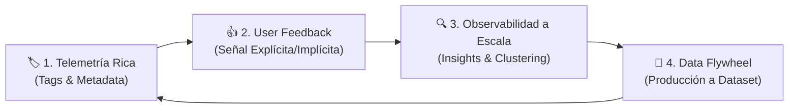

# 🎓 Clase Magistral: Módulo 3 - Lección 1

## *"Moving Towards Production: Del Laboratorio al Tráfico Real"*

> **Curso Oficial**: [LangChain Academy - Building Reliable Agents: Module 3 - Lesson 1](https://academy.langchain.com/courses/take/building-reliable-agents/)  
> **Script Práctico**: [`production_telemetry.py`](file:///home/juansebas7ian/Proyectos/GitHub/Building_Reliable_Agents/module-3/lesson-1/production_telemetry.py)  
> **Agente Evaluado**: Emma v5 ([`agent_v5.py`](file:///home/juansebas7ian/Proyectos/GitHub/Building_Reliable_Agents/officeflow-agent/agent_v5.py))  
> **Módulo de Métricas**: [`token_utils.py`](file:///home/juansebas7ian/Proyectos/GitHub/Building_Reliable_Agents/module-2/token_utils.py)  
> **Plataforma de Trazabilidad**: [LangSmith Tracing](https://smith.langchain.com/)  

---

## 👨‍🏫 1. Introducción Pedagógica: El Salto al Mundo Real

Bienvenido al **Módulo 3: Moving Towards Production**.

A lo largo de los dos primeros módulos hemos construido una base técnica sólida:
1. **Módulo 1 (Observation)**: Aprendimos a observar a nuestro agente. Desglosamos cada pensamiento, consulta SQL y llamada a herramientas en trazas jerárquicas con LangSmith, identificando por qué fallaba el agente frente a los requerimientos del PRD.
2. **Módulo 2 (Evaluation)**: Construimos un laboratorio de pruebas científicas. Aprendimos a crear datasets curados (`officeflow-dataset`), a diseñar evaluadores deterministas basados en código (reglas de negocio), evaluadores cualitativos con **LLM-as-a-Judge**, y finalmente experimentos pareados A/B para comparar rigurosamente si la versión `v5` superaba a la `v4`.

Ahora supongamos que tu experimento pareado del Módulo 2 arrojó un contundente **80% de victorias a favor de Emma v5**, con menor consumo de tokens y cero violaciones a las políticas de stock. Tu equipo decide pulsar el botón verde: **¡Desplegamos a Producción!**

En ese preciso instante, las reglas del juego cambian radicalmente.

> *"En el laboratorio (offline), tú controlas las preguntas. En producción (online), los usuarios controlan el caos."*

---

## ⚖️ 2. El Abismo: Pre-Producción (Offline) vs. Producción (Online)

¿Por qué un agente que obtiene un 95% de acierto en tus datasets de prueba puede fracasar estrepitosamente en producción?

Veamos la comparativa estructural entre ambos entornos:

| Dimensión | Evaluación Offline (Laboratorio / Módulo 2) | Entorno de Producción (Online / Módulo 3) |
| :--- | :--- | :--- |
| **Entrada (Input)** | Dataset estático y acotado (ej. 25 a 100 preguntas predefinidas). | Espacio abierto e infinito de entradas de usuarios reales. |
| **Comportamiento del Usuario** | Amigable, estructurado, alineado al PRD. | Ambigüedades, faltas de ortografía, sarcasmo, ataques de *prompt injection*, preguntas fuera de dominio (*out-of-scope*). |
| **Volumen** | Decenas o cientos de ejecuciones esporádicas. | Miles o millones de consultas diarias de manera continua. |
| **Coste de Evaluación** | Factible evaluar el 100% de los casos con LLMs jueces pesados. | Prohibitivo evaluar cada traza en vivo con un modelo juez grande en tiempo real. |
| **Latencia Aceptable** | Los benchmarks pueden tardar minutos u horas en completarse en segundo plano. | La respuesta al usuario debe devolverse en < 2-4 segundos; la telemetría no debe bloquear la UI. |
| **Señal de Verdad** | *Ground Truth* de referencia predefinido por los desarrolladores. | Inexistente a priori: la señal de éxito proviene de la satisfacción del usuario y telemetría de negocio. |

---

## 🏗️ 3. Los Cuatro Pilares para la Fiabilidad en Producción

Para cerrar esta brecha, la ingeniería moderna de agentes de IA se apoya en cuatro pilares fundamentales:



---

### Pilar 1: Instrumentación y Telemetría Contextual Rica

En producción, una traza sin contexto es prácticamente inútil. Si un cliente reporta *"El agente me dio una respuesta incorrecta hoy a las 10 AM"*, buscar entre 100,000 trazas sin metadatos es buscar una aguja en un pajar.

Debemos enriquecer cada llamada al agente con dos mecanismos nativos de LangSmith:

1. **Tags (Etiquetas)**:
   - Cadenas cortas e indexadas para filtrado rápido en la interfaz gráfica.
   - Ejemplos: `["production", "tier_enterprise", "channel_web", "release_v5.2"]`.
2. **Metadata (Metadatos Clave-Valor)**:
   - Diccionario JSON con atributos detallados del entorno y la sesión.
   - Ejemplos:
     ```python
     {
         "user_id": "usr_9948",
         "session_id": "sess_live_101",
         "customer_tier": "enterprise",
         "environment": "production",
         "release": "emma-v5.2.0",
         "region": "us-east-1"
     }
     ```

#### ¿Cómo se envía en código?
Al usar `@traceable`, LangSmith permite pasar el argumento reservado `langsmith_extra`:

```python
result = await chat(
    user_query,
    langsmith_extra={
        "metadata": {
            "user_id": user_id,
            "session_id": session_id,
            "release": "emma-v5.2.0",
            "environment": "production"
        },
        "tags": ["production", "release_v5.2"]
    }
)
```

---

### Pilar 2: Captura de Retroalimentación de Usuario (*User Feedback*)

La señal más valiosa en producción no proviene de un benchmark sintético, sino del usuario que interactúa con el agente. Existen dos tipos de retroalimentación:

#### A. Feedback Explícito
Interacciones directas donde el usuario expresa su grado de satisfacción:
* **Botones de Pulgar Arriba / Pulgar Abajo (👍 / 👎)**: Mapeados a un score binario (`1.0` o `0.0`).
* **Calificaciones por Estrellas (1 a 5)**.
* **Comentarios de Texto Abierto**: Explicaciones del usuario sobre qué falló.

En LangSmith, el feedback se asocia directamente al identificador único de la traza (`run_id`):

```python
from langsmith import Client

client = Client()
client.create_feedback(
    run_id=run_id,
    key="user_rating",
    score=1.0,  # 1.0 para 👍, 0.0 para 👎
    comment="Respuesta muy rápida y resolvió mi duda sobre la política de stock."
)
```

#### B. Feedback Implícito
Señales de comportamiento inferidas por la aplicación sin intervención activa del usuario:
* **Tasa de Copiado**: El usuario copió la respuesta del agente al portapapeles (suele indicar alta utilidad).
* **Escalamiento Humano**: El usuario solicitó hablar con un operador humano inmediatamente después de la respuesta (indica fracaso del agente).
* **Tiempo de Permanencia / Abandono**: El usuario cerró la pestaña tras esperar 8 segundos sin respuesta.

---

### Pilar 3: Estrategias de Muestreo (*Trace Sampling*)

En aplicaciones a gran escala que procesan millones de interacciones, almacenar o evaluar el 100% de las trazas con LLMs adicionales puede resultar prohibitivo en términos de costes de tokens y almacenamiento.

Se emplean dos estrategias de muestreo:
1. **Muestreo Aleatorio Proporcional (Head Sampling)**: Se analiza sistemáticamente una fracción del tráfico total (ej. un 5% aleatorio) para monitorear métricas basales de calidad y latencia.
2. **Muestreo Basado en Reglas o Anomalías (Tail Sampling)**: Se captura y analiza el 100% de las trazas que cumplan condiciones críticas:
   - Cualquier traza que haya recibido feedback negativo (👎).
   - Trazas donde ocurrió una excepción o error HTTP 500.
   - Trazas con latencia anómala (ej. p99 > 5 segundos).
   - Trazas que ejecutaron más de 4 llamadas repetitivas a herramientas (posible bucle infinito del agente).

---

### Pilar 4: El Volante de Inercia de Datos (*The Production Data Flywheel*)

El verdadero secreto de los agentes altamente fiables no es que nunca cometan errores, sino **qué tan rápido aprenden de sus errores en producción**.

El **Data Flywheel** conecta la telemetría de producción con el sistema de evaluación offline del Módulo 2:

```mermaid
flowchart TD
    PROD["Tráfico en Producción (Emma v5)"] -->|Trazas en Vivo| TRACE["LangSmith Traces"]
    TRACE -->|Filtro: Feedback 👎 o Excepción| ANOMALIES["Trazas Problemáticas Detectadas"]
    ANOMALIES -->|Exportar / Añadir Ejemplo| DATASET["Dataset de Evaluación (officeflow-dataset)"]
    DATASET -->|Nuevas Pruebas de Regresión| DEV["Desarrollo de Emma v6"]
    DEV -->|Pairwise Evals A/B (Módulo 2 Lección 6)| RELEASE["Despliegue a Producción"]
    RELEASE --> PROD
```

1. Un cliente en producción hace una pregunta imprevista y el agente responde incorrectamente (el usuario marca 👎).
2. LangSmith etiqueta automáticamente la traza con `feedback_score = 0.0`.
3. Un ingeniero (o un proceso automatizado) toma el input del usuario y la respuesta ideal corregida y la añade como un nuevo ejemplo al dataset `officeflow-dataset`.
4. Cuando el equipo programa **Emma v6**, la suite de evaluación ya incluye ese caso de prueba real.
5. **Resultado**: El agente jamás volverá a cometer el mismo error en producción.

---

## 💻 4. Demostración Práctica: `production_telemetry.py`

En esta lección hemos creado el script [`production_telemetry.py`](file:///home/juansebas7ian/Proyectos/GitHub/Building_Reliable_Agents/module-3/lesson-1/production_telemetry.py), el cual simula el ciclo de vida completo de dos peticiones en producción:

1. **Petición Enterprise (👍)**:
   - Consulta: *"Do you have heavy duty staplers in stock?"*
   - Telemetría: `user_id = usr_enterprise_882`, `channel = web_portal`, `tier = enterprise`.
   - Resultado: Emma consulta la base de datos, respeta la política de bandas de stock y responde concisamente en 2.45 s (54 tokens).
   - Feedback: Calificación positiva (1.0).

2. **Petición Retail con Queja (👎)**:
   - Consulta: *"What is your return policy for damaged items?"*
   - Telemetría: `user_id = usr_retail_304`, `channel = mobile_app`, `tier = retail`.
   - Resultado: Emma consulta la base de conocimiento RAG y explica la política de devoluciones en 3.99 s (163 tokens).
   - Feedback: Calificación negativa (0.0) con comentario: *"El agente no me dio el enlace directo al formulario"*.

### Ejecución del Script:
```bash
uv run python module-3/lesson-1/production_telemetry.py
```

---

## 🗺️ 5. Hoja de Ruta del Módulo 3

Con los conceptos de esta Lección 1 claros, estamos listos para explorar las técnicas avanzadas de observabilidad y evaluación a escala:

* **Lección 1 (Esta sesión)**: Fundamentos de Producción, Telemetría, Tags, Metadata y User Feedback.
* **Lección 2**: **Insights Agent** — Análisis masivo y automatizado de trazas. Aprenderemos a generar cientos de trazas sintéticas (`generate_traces.py`), subirlas con desplazamiento temporal (`upload_traces.py`), y usar agentes LLM para clasificar intenciones y patrones de fallo a escala.
* **Lección 3**: **Online Evals** — Evaluadores en tiempo real que inspeccionan el flujo de producción de forma continua sin afectar la experiencia del usuario.

¡Continuemos con la excelencia técnica hacia sistemas de IA autónomos, robustos y confiables!
