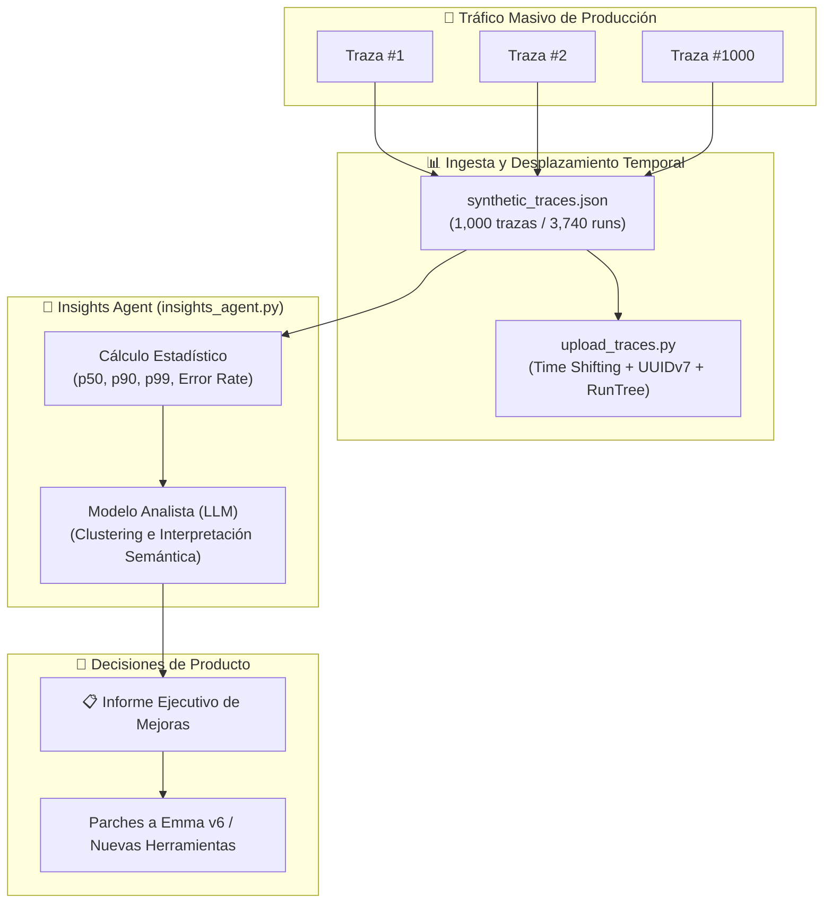

# 🎓 Clase Magistral: Módulo 3 - Lección 2

## *"Insights Agent: Observabilidad a Escala y Detección de Patrones Masivos"*

> **Curso Oficial**: [LangChain Academy - Building Reliable Agents: Module 3 - Lesson 2](https://academy.langchain.com/courses/take/building-reliable-agents/)  
> **Script de Ingesta**: [`upload_traces.py`](file:///home/juansebas7ian/Proyectos/GitHub/Building_Reliable_Agents/module-3/lesson-2/upload_traces.py)  
> **Script de Generación**: [`generate_traces.py`](file:///home/juansebas7ian/Proyectos/GitHub/Building_Reliable_Agents/module-3/lesson-2/generate_traces.py)  
> **Agente de Análisis**: [`insights_agent.py`](file:///home/juansebas7ian/Proyectos/GitHub/Building_Reliable_Agents/module-3/lesson-2/insights_agent.py)  
> **Dataset de Trazas**: [`synthetic_traces.json`](file:///home/juansebas7ian/Proyectos/GitHub/Building_Reliable_Agents/module-3/lesson-2/synthetic_traces.json) (1,000 trazas / 3,740 ejecuciones)  
> **Plataforma**: [LangSmith Insights & Tracing](https://smith.langchain.com/)  

---

## 👨‍🏫 1. Introducción Pedagógica: La Trampa de la Escala

En el **Módulo 1**, aprendiste a abrir la consola de LangSmith y leer una traza paso a paso:
> *"El usuario preguntó por resmas de papel -> Emma llamó a SQL -> devolvió 45 cajas -> Emma respondió cordialmente."*

Esta inspección manual es perfecta cuando estás desarrollando un prototipo. Pero cuando tu agente se despliega en producción para OfficeFlow Supply Co. y atiende **1,000 o 20,000 conversaciones por día**, surge una pregunta inevitable:

> *"¿Cómo sabemos qué está fallando si un ser humano solo puede leer con atención 20 o 30 trazas al día?"*

Si dependes de la revisión manual:
* El **98% de tus interacciones de producción quedan a ciegas**.
* Solo descubres los fallos cuando los clientes cancelan sus cuentas o envían quejas furiosas a soporte.
* Eres incapaz de detectar patrones sutiles, como un incremento gradual de la latencia en el percentil 95 o un error silencioso en las búsquedas semánticas.

Para solucionar este desafío fundamental nace el **Insights Agent**.

---

## 🎯 2. ¿Qué es un Insights Agent?

Un **Insights Agent** no es un agente de cara al cliente; es un **meta-agente de observabilidad**. Su trabajo es consumir lotes masivos de trazas de producción, estructurarlas, extraer estadísticas de rendimiento y utilizar capacidades cognitivas de LLMs para sintetizar:

1. **Clustering de Intenciones (Top Intents)**: ¿Qué están buscando realmente los usuarios hoy? ¿Han cambiado sus patrones de consumo?
2. **Taxonomía de Modos de Fallo (Failure Modes)**: ¿En qué categorías de preguntas falla el agente? ¿Consultas fuera de dominio (*out-of-scope*)? ¿Fallas de esquema SQL? ¿Respuestas demasiado verbosas?
3. **Distribución de Latencias y Costes**: Cuantificación de los percentiles $p_{50}$, $p_{90}$ y $p_{99}$ y conteo de llamadas a herramientas.
4. **Recomendaciones de Ingeniería Accionables**: Qué modificaciones concretas debemos hacer al prompt del sistema, a la base de conocimiento o a las herramientas para corregir la mayor cantidad de fallos con el menor esfuerzo.



---

## ⚙️ 3. Componentes Técnicos de la Lección

La Lección 2 proporciona tres piezas de código fundamentales:

### 1. `generate_traces.py`: Generador de Tráfico Sintético Realista
Simula semanas de tráfico real de clientes empresariales y minoristas interactuando con las versiones v0 a v5 de Emma. Genera escenarios diversos:
- Preguntas directas de una sola interacción.
- Consultas complejas multi-herramienta (SQL + RAG).
- Consultas ambiguas o fuera de alcance (ej. *"¿Cómo soluciono un error técnico en el carrito de compras?"*).
- Distribuciones log-normales de latencia de red y ejecución de tokens.

### 2. `upload_traces.py`: Ingesta Masiva con *Time Shifting*
Cuando guardas trazas en un archivo JSON estático, sus marcas de tiempo corresponden al pasado. Si las subes tal cual a LangSmith, aparecerán archivadas hace semanas o meses y no serán visibles en los paneles de telemetría de hoy.

`upload_traces.py` resuelve esto mediante **Desplazamiento Temporal (Time Shifting)**:
```python
# 1. Encontrar la fecha más reciente del lote
latest = max(clean_dts)

# 2. Calcular la diferencia con el momento actual en UTC
time_delta = datetime.now(timezone.utc).replace(tzinfo=None) - latest

# 3. Desplazar todas las trazas hacia el presente
new_start_time = old_start_time + time_delta
```
Además, mapea los IDs antiguos a nuevos `UUIDv7` frescos para evitar colisiones y reconstruye el árbol jerárquico usando `RunTree`.

### 3. `insights_agent.py`: El Agente Analizador en Acción
Este script implementa el flujo de trabajo analítico completo:
1. Reconstruye las 1,000 trazas desde `synthetic_traces.json`.
2. Calcula métricas de latencia ($p_{50} = 6.13\text{ s}$, $p_{90} = 9.29\text{ s}$, $p_{99} = 11.10\text{ s}$).
3. Envía una muestra representativa al modelo LLM (`qwen2.5:7b` en Ollama local o `gpt-4o`/`gpt-5-nano` en OpenAI) con un prompt de analista de sistemas.
4. Genera el informe de intenciones, fallos y recomendaciones.

---

## 📊 4. Hallazgos Reales del Insights Agent sobre OfficeFlow

Al ejecutar el análisis sobre las 1,000 trazas sintéticas, el Insights Agent descubrió:

| Categoría de Hallazgo | Resultado del Análisis | Impacto en Producción |
| :--- | :--- | :--- |
| **Top Intent #1** | *Product Availability* (Disponibilidad de stock) | 20% del tráfico total. Los clientes necesitan respuestas inmediatas sobre existencias. |
| **Top Intent #2** | *Order Placement & Status* (Pedidos y estados) | 20% del tráfico total. Son consultas que Emma tiene prohibido procesar directamente por PRD. |
| **Failure Mode #1** | *Out-of-Scope Queries sin desvío ágil* | El agente repite explicaciones largas sobre cómo contactar a otros departamentos en lugar de ofrecer un enlace directo o email conciso. |
| **Failure Mode #2** | *Ausencia de herramientas especializadas* | Consultas sobre seguimiento de pedidos no tienen herramienta asociada, obligando a Emma a redactar respuestas estáticas. |
| **Recomendación #1** | *Base de conocimiento estructurada para soporte* | Definir respuestas precalculadas breves para preguntas frecuentes de pedidos y devoluciones. |
| **Recomendación #2** | *Herramienta de estado de pedidos para Emma v6* | Diseñar una herramienta segura `check_order_status(order_id)` con permisos de solo lectura para evitar desvíos humanos innecesarios. |

---

## 🚀 5. Cómo Ejecutar la Lección 2

### A. Ejecutar el Insights Agent Localmente (Recomendado):
```bash
uv run python module-3/lesson-2/insights_agent.py --sample-size 20
```

### B. Subir las Trazas a LangSmith Cloud (Opcional, si tienes API Key):
```bash
uv run python module-3/lesson-2/upload_traces.py --project lca-reliable-agents
```
Al finalizar, abre tu panel en [LangSmith](https://smith.langchain.com/) para explorar las 1,000 trazas activas del día de hoy y revisar las visualizaciones interactivas de clustering y embudos de latencia.

---

## 🔗 Próximo Paso: Lección 3 (Online Evals)

Ahora que sabemos cómo analizar trazas masivamente en lote (*batch*), el siguiente paso es la **evaluación continua en tiempo real**: calificar cada traza según llega, detectando alucinaciones y violaciones de políticas de negocio mientras los usuarios navegan en vivo.
